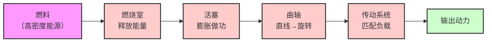
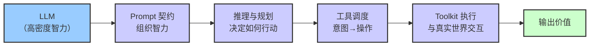

# PinPawo Agent

Open-source agent runtime, local CLI/TUI, browser toolkit, and macOS companion for PinPawo.

The repository contains the public, local-first agent stack: orchestration, Capability and Toolkit contracts, session projection, Studio coordination, local transports, and developer tooling. It does not contain the private PinPawo app, hosted backend, Hasura metadata, production credentials, or other internal product code.

## Vision

### 智能革命的"发动机"

工业革命的起点，是人类开始理解"能量"。

起初，我们利用自然中松散的能力——风力和水力，但能量密度低、不可控。后来我们学会了开采高密度能量（煤炭、石油），并不断寻找更高效的方式来利用它。**发动机**就是这一进步的技术结晶：它把高密度能量转化为可控、可组合、可量产的机械动力。发动机的原理并不复杂，但不同的发动机适配不同的场景——汽车用四缸内燃机、发电厂用蒸汽轮机、飞机用喷气发动机。发动机本身只是开始；接下来要接上传动轴、轮子、控制系统，才能让能量真正创造价值。

我们正在经历一场平行的变革——**智能革命**。

人类一直拥有自然存在的智力，但智力密度很低，受限于个体、时间和传递成本。大语言模型（LLM）的出现让我们第一次能够通过能源大规模产出智力。问题随之而来：这些高密度的智力如何高效地运转起来、创造价值？这正是 **agent（harness）** 要回答的问题。如果 LLM 是高密度智力的来源，那么 agent harness 就是这场智能革命的"发动机"——它决定智力如何被组织、调度、约束和释放。

和发动机一样，agent harness 的原理并不神秘，但不同场景需要不同形态：个人助手是"四缸发动机"，企业级多 agent 协作是"蒸汽轮机"。发动机之上还要接上轮子和控制系统——agent harness 之上还要接上工具、传输、存储和人机交互。

下方的两张流程图展示了这种平行关系——左侧是发动机如何利用能源输出动力，右侧是 agent 如何利用智力输出价值：





| 发动机 | Agent | 共同角色 |
|---|---|---|
| 燃料（高密度能源） | LLM（高密度智力） | 高密度能量来源 |
| 燃烧室（释放能量） | Prompt 契约（组织智力） | 释放与组织 |
| 活塞（膨胀做功） | 推理与规划（决定如何行动） | 核心转化 |
| 曲轴（直线→旋转） | 工具调度（意图→操作） | 形态转换 |
| 传动系统（匹配负载） | Toolkit 执行（与真实世界交互） | 适配与执行 |
| 输出动力 | 输出价值 | 最终产出 |

### 循环的本质：能量+空气 vs token+context

上面的流程图展示的是单次转化，但发动机和 agent 真正的力量来自**循环**——不是一次性转化，而是持续往复。

发动机吸入空气与燃料混合燃烧，活塞做功输出动力，做功后活塞回到初始位置，新鲜空气再次涌入，开始下一轮循环。关键在于：每一轮的做功不是孤立的，而是循环中的能量持续释放。

Agent 同样如此。它读入 context（上下文——用户意图、历史对话、工具反馈），与 token（LLM 的推理能力）混合，推理产出新的 token——可能是一个回答，也可能是一次工具调用。产出的结果不丢弃，而是作为新的 context 重新输入下一轮循环。每一轮的推理都建立在前一轮的累积之上，智力在循环中迭代逼近目标。
做功后的状态回流，就像活塞做完功回到原点准备下一轮进气——不是为了"排掉"什么，而是为了让循环闭合。

| 发动机循环 | Agent 循环 | 共同角色 |
|---|---|---|
| 进气（吸入空气+燃料） | 感知（读入 context + token） | 吸入原料 |
| 压缩（混合并加压） | 组织与聚焦（prompt 契约、注意力聚焦） | 压缩与组织 |
| 燃烧做功（释放能量） | 推理与行动（产出 token、调用工具） | 核心做功 |
| 活塞回位（做功后回到原点，准备再进气） | 状态回流（产出融入 context，成为下一轮输入） | 循环闭合 |
| → 回到进气 | → 回到感知 | 循环 |

这就是 agent harness 的核心职责：让这个循环**稳定地转起来**。发动机的工程化是进气/压缩/燃烧/冷却的精密配合；agent 的工程化是 context 管理、token 调度、工具执行、反馈融合和状态持久化的精密配合。循环转得越稳、越快、越久，创造的价值就越大。

**PinPawo Agent 探索的，正是这场智能革命中"发动机"的工程化路径**：我们研究什么技术能高效地组织智力、如何让 agent 在不同场景下可靠运转、如何把 LLM 的能力转化为可交付的价值。本仓库是我们的公开实践——runtime、Capability、Toolkit、Studio 协调、本地 host 和开发者工具都是这台"发动机"的零件。

## Highlights

- Reusable TypeScript runtime for agent orchestration and isolated Capability delegation.
- Local HTTP/WebSocket or JSONL stdio host with checkpoint-backed sessions.
- Ink and OpenTUI terminal clients with tool activity and human-review flows.
- Browser automation through Playwright or a Chrome Extension plus Native Messaging host.
- Studio runtime for multi-Pet dispatch, per-Pet queueing, runtime gates, and plugin-driven workflows.
- Extensible local Capabilities and Toolkit-based plugins.

## Architecture

```text
User / TUI / desktop app
        |
        v
local-agent host ---- browser and local Toolkits
        |
        v
pet-agent orchestrator
        |
        +-- direct answer
        +-- isolated Capability lane
        +-- Studio dispatch through plugin-driven multi-Pet coordination
        |
        v
checkpoint state + capability artifacts + plugin-owned workflow state
```

The main boundaries are:

| Boundary | Responsibility |
|---|---|
| Pet agent | Actor identity, orchestration, delegation, review policy, and model execution. |
| Capability | A focused business ability executed in an isolated subagent lane. |
| Toolkit | A typed family of tools, operation metadata, availability, and review guidance. |
| Session | Runtime-neutral event projection, snapshots, resume state, and transport contracts. |
| Studio | Multi-Pet dispatch, per-Pet queues, runtime gates, and plugin event fan-out. |

## Repository Layout

| Path | Purpose |
|---|---|
| `packages/agent-contracts/` | Shared wire and event contracts. |
| `packages/agent-session/` | Session domain, projection, snapshots, parsers, and protocol types. |
| `packages/pet-agent/` | Core agent runtime, orchestrator, Capability contracts, and evaluations. |
| `packages/studio/` | Runtime-independent Studio coordination. |
| `services/local-agent/` | Published `pinpawo` CLI, local host, configuration, and integrations. |
| `services/tui/` | OpenTUI client and distribution bundle. |
| `toolkits/browser/` | Browser Toolkit, drivers, extension, and Native Messaging host. |
| `toolkits/studio-kanban/` | Studio Kanban Toolkit and plugin. |
| `tools/agent-macos/` | macOS desktop companion. |
| `docs/concepts/` | Project vocabulary and architecture for new contributors. |
| `docs/guides/` | Installation, configuration, and browser-operation guides. |
| `docs/reference/` | Current API, extension, runtime, artifact, and tool contracts. |
| `docs/studio/` | Current multi-agent push model, configuration, host integration, and API links. |
| `docs/design/` / `docs/history/` | Proposals and rationale / superseded records that do not define current behavior. |

The repository root is a private npm workspace. Publishable packages live in their respective workspace directories.

## Requirements

- Node.js `>=24` (Node 24 LTS and Node 26 are validated)
- npm
- macOS only when building `tools/agent-macos/`

The macOS companion currently keeps its separate bundled Node 20 toolchain and is outside the npm package compatibility target.

## Quick Start

Install the CLI globally:

```bash
npm install -g pinpawo
pinpawo init
pinpawo setup
pinpawo tui
```

Or run it without a global install:

```bash
npx pinpawo init
npx pinpawo tui
```

`pinpawo init` creates:

- `~/.pinpawo/.env`
- `~/.pinpawo/capabilities/`
- `~/.pinpawo/capabilities/hello-pinpawo/`

Validate the generated example with:

```bash
pinpawo capability validate ~/.pinpawo/capabilities/hello-pinpawo
```

See [services/local-agent/README.md](services/local-agent/README.md) for TUI v2, stdio, extension setup, and package-level release details.

## Local Development

```bash
npm install
npm run typecheck
npm test
npm run build
```

Start the local TUI from source:

```bash
cd services/local-agent
npm run tui
```

Smoke-test the built CLI:

```bash
node services/local-agent/dist/index.js init --dir /tmp/pinpawo-demo
node services/local-agent/dist/index.js capability validate /tmp/pinpawo-demo/capabilities/hello-pinpawo
```

## Configuration

Configuration is resolved from:

1. `~/.pinpawo/config.json`
2. `~/.pinpawo/.env`
3. process environment variables

Edit `~/.pinpawo/.env` to configure credentials and model settings; use `pinpawo setup` for diagnostics. Never commit local credentials or generated runtime state.

| Key | Purpose |
|---|---|
| `API_BASE_URL` | PinPawo API base URL. |
| `HASURA_ENDPOINT` | Hasura GraphQL endpoint. |
| `AGENT_TOKEN` | Agent API token. |
| `HASURA_JWT` | Hasura JWT. |
| `LLM_API_KEY` | OpenAI-compatible provider API key. |
| `LLM_BASE_URL` | OpenAI-compatible provider base URL. |
| `LLM_MODEL` | Default model. |
| `LLM_CONTEXT_WINDOW_TOKENS` | Optional context-window override for custom models. |
| `PINPAWO_MODEL_PROFILE` | Stored model profile ID. |
| `PINPAWO_LOCAL_ONLY` | Disable hosted API, relay, and Hasura access when set to `1`. |
| `PINPAWO_WORKDIR` | Default runtime working directory. |
| `PINPAWO_BROWSER_BACKEND` | `auto`, `playwright`, or `extension`. |
| `LOCAL_SERVER_PORT` | Local HTTP/WebSocket port. |

A complete `LLM_API_KEY` + `LLM_BASE_URL` + `LLM_MODEL` tuple creates an ephemeral environment profile. Partial tuples are not mixed with stored profiles. See [Model Profile Configuration](docs/guides/model-profiles.md).

## CLI

| Command | Purpose |
|---|---|
| `pinpawo` / `pinpawo server` | Start the local host in chat mode. |
| `pinpawo run` | Alias for `pinpawo server`. |
| `pinpawo server --mode studio` | Start in Studio mode. |
| `pinpawo server --stdio` | Use a single JSONL stdio peer instead of HTTP/WebSocket. |
| `pinpawo init` | Create local config and the example Capability. |
| `pinpawo setup` | Diagnose configuration and show next steps. |
| `pinpawo actor` | Select the local pet actor. |
| `pinpawo tui` | Start the terminal client. |
| `pinpawo detect` | Print browser and backend detection as JSON. |
| `pinpawo capability list` | List installed user Capabilities. |
| `pinpawo capability validate <dir>` | Validate a Capability directory. |
| `pinpawo capability install <dir>` | Install a Capability. |
| `pinpawo capability install <dir> --link` | Link a Capability in place. |

## Capabilities and Plugins

User Capabilities live under `~/.pinpawo/capabilities/<id>/`. Each directory contains a code-free `CAPABILITY.md`; an optional entry module may expose the narrow lifecycle finalizer contract. The old `manifest.json` plus `index.js` format is no longer loaded.

Local plugins are loaded from:

```text
~/.pinpawo/plugins/*.mjs
~/.pinpawo/plugins/*.js
```

Plugins export Toolkits rather than loose tools so availability, operation metadata, and review policy stay under one typed owner:

```js
import { defineToolkit } from '@pinpawo/pet-agent';

export const toolkits = [
  defineToolkit({
    name: 'sample_plugin',
    description: 'Sample local plugin Toolkit',
    tools: [
      // LangChain StructuredTool instances
    ],
  }),
];

export default { name: 'sample-plugin' };
```

Legacy top-level `tools` exports are ignored.

## Browser Toolkit

Browser `auto` mode prefers a connected Chrome Extension for supported default-session operations and falls back to Playwright. Force a backend with `PINPAWO_BROWSER_BACKEND=extension` or `playwright`.

For extension setup:

```bash
pinpawo browser extension status
pinpawo browser extension register --extension-id <id>
pinpawo browser extension repair --extension-id <id>
pinpawo browser extension unregister
```

See [Chrome Extension Browser Backend](docs/guides/browser-bridge.md) for the protocol, security model, and supported interaction scope.

## Runtime State

| Path | Owner |
|---|---|
| `~/.pinpawo/config.json` | Saved local configuration. |
| `~/.pinpawo/.env` | Environment-style configuration. |
| `~/.pinpawo/capabilities/` | Installed user Capabilities. |
| `~/.pinpawo/plugins/` | Local plugin modules. |
| `<workdir>/.pinpawo/studio.json` | Studio configuration. |
| `<workdir>/.pinpawo/pets/` | Per-pet Studio configuration. |

LangGraph checkpoints are authoritative for resumable runtime state. Capability outputs that must survive lane cleanup belong in the artifact store; runtime messages and tool events are traces, not durable product records.

## Documentation

Start with the [Documentation Index](docs/index.md). The primary public path is:

- [Getting Started](docs/guides/getting-started.md)
- [Core Concepts](docs/concepts/core-concepts.md)
- [Architecture](docs/concepts/architecture.md)
- [Capability / Toolkit Contract](docs/reference/extensions/capability-toolkit.md)
- [API Reference](docs/reference/api/index.md)
- [Studio](docs/studio/index.md)

简体中文入口：[PinPawo Agent 文档](docs/zh-CN/index.md)。

The documentation index also separates current contracts from detailed design
records and historical context.

## Quality Gates

```bash
npm run typecheck
npm test
npm run build
```

Package-level examples:

```bash
npm run typecheck -w @pinpawo/pet-agent
npm run test -w @pinpawo/pet-agent
npm run typecheck -w pinpawo
npm run test:unit -w pinpawo
```

## Security

- Never commit `.env`, tokens, JWTs, API keys, checkpoints, local session state, or generated build output.
- Treat plugin code, Capability code, browser content, external messages, and artifact contents as untrusted input.
- Keep review policy and human approval in the execution boundary for side-effecting tools.
- Keep private app, backend, and Hasura code in the internal PinPawo repository.

## Contributing

Keep runtime-independent agent logic in `packages/`. Put local machine, CLI, browser, transport, and desktop integrations in `services/`, `toolkits/`, or `tools/` as appropriate. TypeScript uses two-space indentation, semicolons, and single quotes.

Before opening a pull request, run the relevant quality gates and include the problem, implementation summary, validation performed, and any compatibility or security impact.

## Publishing

```bash
npm run typecheck
npm test
npm run build
npm pack --dry-run -w @pinpawo/pet-agent
npm run pack:dry -w pinpawo
```

Review package contents before publishing. Confirm versions, the quick-start commands, and the absence of private endpoints, credentials, local state, or generated artifacts.

## License

Licensed under the [MIT License](LICENSE).
