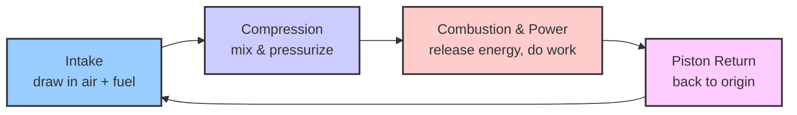
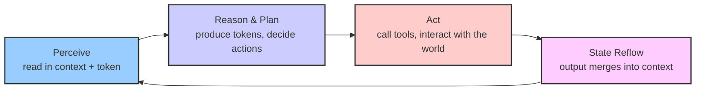

# PinPawo Agent

Open-source agent runtime, local CLI/TUI, browser toolkit, and macOS companion for PinPawo.

The repository contains the public, local-first agent stack: orchestration, Capability and Toolkit contracts, session projection, Studio coordination, local transports, and developer tooling. It does not contain the private PinPawo app, hosted backend, Hasura metadata, production credentials, or other internal product code.

## Vision

### The "Engine" of the Intelligence Revolution

The Industrial Revolution began when humanity started understanding "energy."

At first, we harnessed diffuse natural forces—wind and water—but energy density was low and uncontrollable. Then we learned to extract high-density energy (coal, petroleum) and kept finding more efficient ways to use it. The **engine** is the technical crystallization of this progress: it transforms high-density energy into controllable, composable, mass-producible mechanical power. The principle of an engine is not complicated, but different engines suit different scenarios—cars use four-cylinder internal combustion engines, power plants use steam turbines, aircraft use jet engines. The engine itself is only the beginning; you still need to attach driveshafts, wheels, and control systems before that energy can truly create value.

We are living through a parallel transformation—the **Intelligence Revolution**.

Humans have always possessed natural intelligence, but its density is low—constrained by individuals, time, and the cost of transmission. Large Language Models (LLMs) let us, for the first time, produce intelligence at scale through energy. The question follows: how do we make this high-density intelligence run efficiently and create value? That is precisely the question **agent (harness)** answers. If the LLM is the source of high-density intelligence, then the agent harness is the "engine" of this Intelligence Revolution—it determines how intelligence is organized, dispatched, constrained, and released.

Like the engine, the principle of agent harness is not mysterious, but different scenarios demand different forms: a personal assistant is a "four-cylinder engine," enterprise-grade multi-agent collaboration is a "steam turbine." And just as an engine needs wheels and control systems on top of it, an agent harness needs tools, transports, storage, and human-machine interaction layered on top.

The two cycle diagrams below illustrate this parallel—the left shows how an engine continuously turns energy into power, the right shows how an agent continuously turns intelligence into value:





| Engine | Agent | Shared Role |
|---|---|---|
| Intake (draw in air + fuel) | Perceive (read in context + token) | Draw in raw material |
| Compression (mix & pressurize) | Reason & plan (organize intelligence) | Compress & organize |
| Combustion & power (release energy, do work) | Act (call tools, interact with the world) | Core work |
| Piston return (back to origin) | State reflow (output merges into context) | Close the loop |
| → back to intake | → back to perceive | Cycle repeats |

### The Essence of the Loop: Energy + Air vs Token + Context

Both diagrams above are **cycles**, not one-shot pipelines. The real power of an engine or agent comes from **the loop**—a continuous cycle, not a single transformation.

An engine draws in air, mixes it with fuel, combusts, the piston does work and outputs power, then returns to its starting position as fresh air rushes in to begin the next cycle. The key insight: each stroke is not isolated; energy is continuously released across cycles.

An agent works the same way. It reads in context (user intent, conversation history, tool feedback), mixes it with tokens (the LLM's reasoning capability), and produces new tokens—perhaps an answer, perhaps a tool call. The output is not discarded; it becomes new context fed back into the next cycle. Each round of reasoning builds on the accumulated results of the previous round; intelligence iteratively converges toward the goal within the loop.
After doing its work, the state flows back—just as a piston returns to its origin after the power stroke to prepare for the next intake. It is not about "exhausting" anything; it is about closing the loop.

This is the core responsibility of an agent harness: **keep the loop running stably**. Engine engineering is the precise coordination of intake / compression / combustion / cooling; agent engineering is the precise coordination of context management, token scheduling, tool execution, feedback integration, and state persistence. The more stable, fast, and long-running the loop, the greater the value created.

**PinPawo Agent explores exactly the engineering path of the "engine" in this Intelligence Revolution**: we study what technologies can efficiently organize intelligence, how to make agents run reliably across different scenarios, and how to translate LLM capability into deliverable value. This repository is our public practice—runtime, Capability, Toolkit, Studio coordination, local host, and developer tooling are all parts of this "engine."

## Highlights

- Reusable TypeScript runtime for agent orchestration and isolated Capability delegation.
- Local HTTP/WebSocket or JSONL stdio host with checkpoint-backed sessions.
- Ink and OpenTUI terminal clients with tool activity and human-review flows.
- Browser automation through Playwright or a Chrome Extension plus Native Messaging host.
- Studio runtime for multi-Pet dispatch, per-Pet queueing, runtime gates, and plugin-driven workflows.
- Extensible local Capabilities and Toolkit-based plugins.

## Architecture

```text
User / TUI / desktop app
        |
        v
local-agent host ---- browser and local Toolkits
        |
        v
pet-agent orchestrator
        |
        +-- direct answer
        +-- isolated Capability lane
        +-- Studio dispatch through plugin-driven multi-Pet coordination
        |
        v
checkpoint state + capability artifacts + plugin-owned workflow state
```

The main boundaries are:

| Boundary | Responsibility |
|---|---|
| Pet agent | Actor identity, orchestration, delegation, review policy, and model execution. |
| Capability | A focused business ability executed in an isolated subagent lane. |
| Toolkit | A typed family of tools, operation metadata, availability, and review guidance. |
| Session | Runtime-neutral event projection, snapshots, resume state, and transport contracts. |
| Studio | Multi-Pet dispatch, per-Pet queues, runtime gates, and plugin event fan-out. |

## Repository Layout

| Path | Purpose |
|---|---|
| `packages/agent-contracts/` | Shared wire and event contracts. |
| `packages/agent-session/` | Session domain, projection, snapshots, parsers, and protocol types. |
| `packages/pet-agent/` | Core agent runtime, orchestrator, Capability contracts, and evaluations. |
| `packages/studio/` | Runtime-independent Studio coordination. |
| `services/local-agent/` | Published `pinpawo` CLI, local host, configuration, and integrations. |
| `services/tui/` | OpenTUI client and distribution bundle. |
| `toolkits/browser/` | Browser Toolkit, drivers, extension, and Native Messaging host. |
| `toolkits/studio-kanban/` | Studio Kanban Toolkit and plugin. |
| `tools/agent-macos/` | macOS desktop companion. |
| `docs/concepts/` | Project vocabulary and architecture for new contributors. |
| `docs/guides/` | Installation, configuration, and browser-operation guides. |
| `docs/reference/` | Current API, extension, runtime, artifact, and tool contracts. |
| `docs/studio/` | Current multi-agent push model, configuration, host integration, and API links. |
| `docs/design/` / `docs/history/` | Proposals and rationale / superseded records that do not define current behavior. |

The repository root is a private npm workspace. Publishable packages live in their respective workspace directories.

## Requirements

- Node.js `>=24` (Node 24 LTS and Node 26 are validated)
- npm
- macOS only when building `tools/agent-macos/`

The macOS companion currently keeps its separate bundled Node 20 toolchain and is outside the npm package compatibility target.

## Quick Start

Install the CLI globally:

```bash
npm install -g pinpawo
pinpawo init
pinpawo setup
pinpawo tui
```

Or run it without a global install:

```bash
npx pinpawo init
npx pinpawo tui
```

`pinpawo init` creates:

- `~/.pinpawo/.env`
- `~/.pinpawo/capabilities/`
- `~/.pinpawo/capabilities/hello-pinpawo/`

Validate the generated example with:

```bash
pinpawo capability validate ~/.pinpawo/capabilities/hello-pinpawo
```

See [services/local-agent/README.md](services/local-agent/README.md) for TUI v2, stdio, extension setup, and package-level release details.

## Local Development

```bash
npm install
npm run typecheck
npm test
npm run build
```

Start the local TUI from source:

```bash
cd services/local-agent
npm run tui
```

Smoke-test the built CLI:

```bash
node services/local-agent/dist/index.js init --dir /tmp/pinpawo-demo
node services/local-agent/dist/index.js capability validate /tmp/pinpawo-demo/capabilities/hello-pinpawo
```

## Configuration

Configuration is resolved from:

1. `~/.pinpawo/config.json`
2. `~/.pinpawo/.env`
3. process environment variables

Edit `~/.pinpawo/.env` to configure credentials and model settings; use `pinpawo setup` for diagnostics. Never commit local credentials or generated runtime state.

| Key | Purpose |
|---|---|
| `API_BASE_URL` | PinPawo API base URL. |
| `HASURA_ENDPOINT` | Hasura GraphQL endpoint. |
| `AGENT_TOKEN` | Agent API token. |
| `HASURA_JWT` | Hasura JWT. |
| `LLM_API_KEY` | OpenAI-compatible provider API key. |
| `LLM_BASE_URL` | OpenAI-compatible provider base URL. |
| `LLM_MODEL` | Default model. |
| `LLM_CONTEXT_WINDOW_TOKENS` | Optional context-window override for custom models. |
| `PINPAWO_MODEL_PROFILE` | Stored model profile ID. |
| `PINPAWO_LOCAL_ONLY` | Disable hosted API, relay, and Hasura access when set to `1`. |
| `PINPAWO_WORKDIR` | Default runtime working directory. |
| `PINPAWO_BROWSER_BACKEND` | `auto`, `playwright`, or `extension`. |
| `LOCAL_SERVER_PORT` | Local HTTP/WebSocket port. |

A complete `LLM_API_KEY` + `LLM_BASE_URL` + `LLM_MODEL` tuple creates an ephemeral environment profile. Partial tuples are not mixed with stored profiles. See [Model Profile Configuration](docs/guides/model-profiles.md).

## CLI

| Command | Purpose |
|---|---|
| `pinpawo` / `pinpawo server` | Start the local host in chat mode. |
| `pinpawo run` | Alias for `pinpawo server`. |
| `pinpawo server --mode studio` | Start in Studio mode. |
| `pinpawo server --stdio` | Use a single JSONL stdio peer instead of HTTP/WebSocket. |
| `pinpawo init` | Create local config and the example Capability. |
| `pinpawo setup` | Diagnose configuration and show next steps. |
| `pinpawo actor` | Select the local pet actor. |
| `pinpawo tui` | Start the terminal client. |
| `pinpawo detect` | Print browser and backend detection as JSON. |
| `pinpawo capability list` | List installed user Capabilities. |
| `pinpawo capability validate <dir>` | Validate a Capability directory. |
| `pinpawo capability install <dir>` | Install a Capability. |
| `pinpawo capability install <dir> --link` | Link a Capability in place. |

## Capabilities and Plugins

User Capabilities live under `~/.pinpawo/capabilities/<id>/`. Each directory contains a code-free `CAPABILITY.md`; an optional entry module may expose the narrow lifecycle finalizer contract. The old `manifest.json` plus `index.js` format is no longer loaded.

Local plugins are loaded from:

```text
~/.pinpawo/plugins/*.mjs
~/.pinpawo/plugins/*.js
```

Plugins export Toolkits rather than loose tools so availability, operation metadata, and review policy stay under one typed owner:

```js
import { defineToolkit } from '@pinpawo/pet-agent';

export const toolkits = [
  defineToolkit({
    name: 'sample_plugin',
    description: 'Sample local plugin Toolkit',
    tools: [
      // LangChain StructuredTool instances
    ],
  }),
];

export default { name: 'sample-plugin' };
```

Legacy top-level `tools` exports are ignored.

## Browser Toolkit

Browser `auto` mode prefers a connected Chrome Extension for supported default-session operations and falls back to Playwright. Force a backend with `PINPAWO_BROWSER_BACKEND=extension` or `playwright`.

For extension setup:

```bash
pinpawo browser extension status
pinpawo browser extension register --extension-id <id>
pinpawo browser extension repair --extension-id <id>
pinpawo browser extension unregister
```

See [Chrome Extension Browser Backend](docs/guides/browser-bridge.md) for the protocol, security model, and supported interaction scope.

## Runtime State

| Path | Owner |
|---|---|
| `~/.pinpawo/config.json` | Saved local configuration. |
| `~/.pinpawo/.env` | Environment-style configuration. |
| `~/.pinpawo/capabilities/` | Installed user Capabilities. |
| `~/.pinpawo/plugins/` | Local plugin modules. |
| `<workdir>/.pinpawo/studio.json` | Studio configuration. |
| `<workdir>/.pinpawo/pets/` | Per-pet Studio configuration. |

LangGraph checkpoints are authoritative for resumable runtime state. Capability outputs that must survive lane cleanup belong in the artifact store; runtime messages and tool events are traces, not durable product records.

## Documentation

Start with the [Documentation Index](docs/index.md). The primary public path is:

- [Getting Started](docs/guides/getting-started.md)
- [Core Concepts](docs/concepts/core-concepts.md)
- [Architecture](docs/concepts/architecture.md)
- [Capability / Toolkit Contract](docs/reference/extensions/capability-toolkit.md)
- [API Reference](docs/reference/api/index.md)
- [Studio](docs/studio/index.md)

简体中文入口：[PinPawo Agent 文档](docs/zh-CN/index.md)。

The documentation index also separates current contracts from detailed design
records and historical context.

## Quality Gates

```bash
npm run typecheck
npm test
npm run build
```

Package-level examples:

```bash
npm run typecheck -w @pinpawo/pet-agent
npm run test -w @pinpawo/pet-agent
npm run typecheck -w pinpawo
npm run test:unit -w pinpawo
```

## Security

- Never commit `.env`, tokens, JWTs, API keys, checkpoints, local session state, or generated build output.
- Treat plugin code, Capability code, browser content, external messages, and artifact contents as untrusted input.
- Keep review policy and human approval in the execution boundary for side-effecting tools.
- Keep private app, backend, and Hasura code in the internal PinPawo repository.

## Contributing

Keep runtime-independent agent logic in `packages/`. Put local machine, CLI, browser, transport, and desktop integrations in `services/`, `toolkits/`, or `tools/` as appropriate. TypeScript uses two-space indentation, semicolons, and single quotes.

Before opening a pull request, run the relevant quality gates and include the problem, implementation summary, validation performed, and any compatibility or security impact.

## Publishing

```bash
npm run typecheck
npm test
npm run build
npm pack --dry-run -w @pinpawo/pet-agent
npm run pack:dry -w pinpawo
```

Review package contents before publishing. Confirm versions, the quick-start commands, and the absence of private endpoints, credentials, local state, or generated artifacts.

## License

Licensed under the [MIT License](LICENSE).
