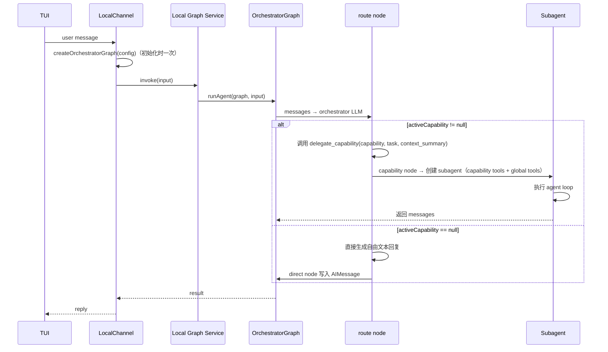
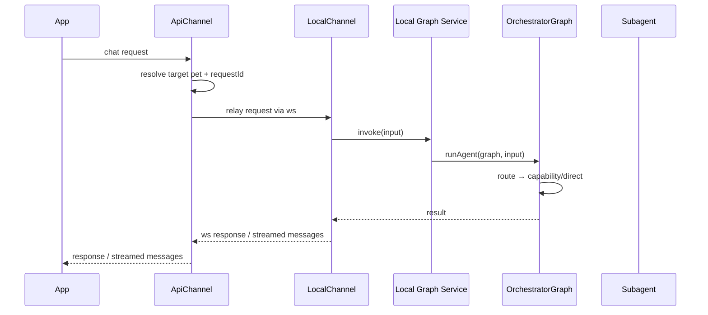
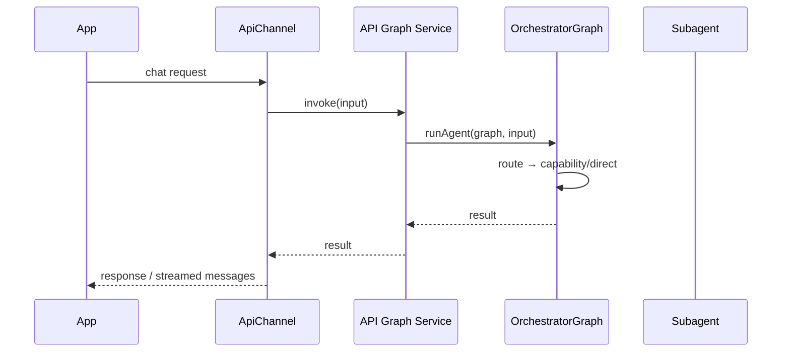
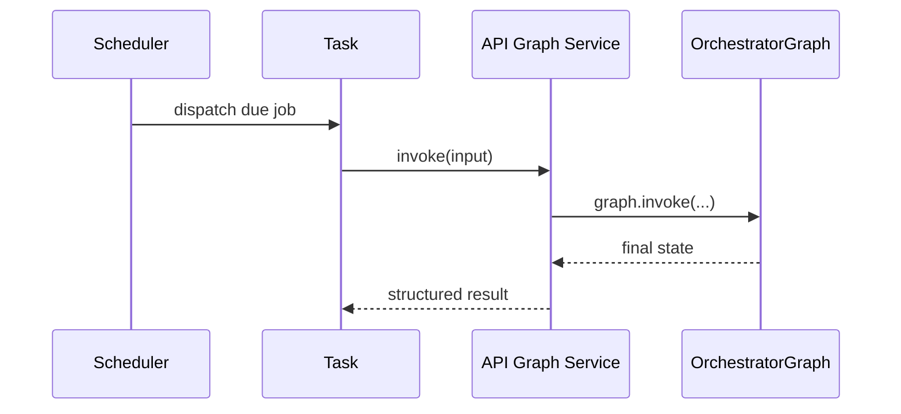

# Pet Agent Design Requirements

> 状态：Draft v2
> 日期：2026-03-30

## 1. 文档目标

这份文档定义新的 `packages/pet-agent/` 包的设计目标、接口边界、目录结构和迁移顺序。

新的 agent 包用于承载：

- Pet Agent 主体
- capability 机制
- subagent 运行机制
- agent 运行入口
- 面向 local-agent 和 api 的统一输入输出接口

## 2. 产品目标

新的 agent 包需要支持以下目标：

1. 提供一个统一的 Pet Agent 执行入口。
2. 支持通过 capability 方式扩展业务能力。
3. 支持通过 subagent 机制隔离执行 capability。
4. 支持 local-agent 和 api 两种接入方式。
5. 支持统一消息输入。
6. 支持统一的消息输出与可选的流式消费方式。
7. 支持 checkpoint 接入。

## 3. 核心模型

新的架构保留四个核心概念：

1. `agent`（orchestrator）
2. `capabilities`
3. `subagent`
4. `channels`

### 3.1 agent（orchestrator）

`agent` 是系统的唯一主体，作为 orchestrator 运行。

它负责：

- 接收统一输入
- 理解当前对话，并决定直接回复或委托给某个 capability
- 通过 subagent 执行 capability
- 在 graph state 中保留 capability 结构化结果
- 返回 reply / messages

### 3.2 capabilities

`capability` 是自包含的业务能力定义，通过 subagent 隔离执行。

第一版内置：`daily_post`、`trend_observe`。

capability 的定义、运行模型和设计约束见 [PET_AGENT_CAPABILITY_RUNTIME_DESIGN.md](./PET_AGENT_CAPABILITY_RUNTIME_DESIGN.md)。

### 3.3 subagent

`subagent` 是通用的隔离执行机制，不特定于任何 capability。

subagent 负责：

- 动态创建一个子 agent
- 装配 tools 和 instructions
- 执行子 agent 的 agent loop
- 返回执行结果

subagent 在需要时动态创建，执行完成后销毁。

### 3.4 toolkits / tools

`tools` 现在分为三层：

- **tool**：最小可调用动作，例如 `browser_open`、`read_file`、`run_shell`
- **toolkit**：一组相关 tools + instructions + availability，例如 `browser`、`bash`
- **capability tools**：在 capability subagent 内部生效的业务工具，orchestrator 和其他 capability 不可见

capability 通过 `uses` 声明要装配的 toolkit。orchestrator 仍然是唯一编排者，capability/subagent 不直接调用其他 capability/subagent。

旧实现曾让 general subagent 自动使用 host 注册的通用 tools 和所有
Toolkit tools。当前统一模型中，`general` 也是普通 Capability，只使用其
静态 `uses` 声明的 Toolkit：

- 自己 `uses` 的 toolkit tools
- capability runtime 提供的 tools

toolkit tools 在装配时可以被 toolkit policy 包装，用于对单个工具调用执行 allow/deny/HITL review；原始工具仍只负责执行。

详细设计见 [PET_AGENT_TOOLKIT_COMPOSITION_DESIGN.md](./PET_AGENT_TOOLKIT_COMPOSITION_DESIGN.md)。

### 3.5 channels

`channels` 是接线层。

第一版包含：

- `local`
- `api`

channel 负责：

- 接收外部请求
- 构造 agent 输入
- 挂接 checkpoint
- 返回响应
- 如需流式展示，由 channel 自行消费 graph/subagent 的消息流
- 持有单一 orchestrator graph 的生命周期

如果某个 service 需要时间驱动任务，也只保留一个很薄的 scheduler：

- scheduler 负责发现何时执行、执行谁
- scheduler 通过接口调用统一 graph service / agent runtime
- scheduler 不形成独立的 agent 执行世界

## 4. 范围定义

### 4.1 新包负责的内容

新的 `packages/pet-agent/` 负责：

- agent 运行入口（runAgent）
- capability 定义与注册
- subagent 运行机制
- global tools 装配
- capability artifact / result 读取约定
- checkpoint 接入

### 4.2 local channel 负责的内容

`local-agent` 负责：

- TUI 输入输出
- 本地插件 tools
- 本地 crawler 数据源
- 本地 checkpoint 文件

### 4.3 api channel 负责的内容

`api` 负责：

- HTTP / WS 接入
- API 侧上下文加载
- API 侧 checkpoint 获取
- API 响应返回
- 如果存在定时任务，只保留 service-side scheduler / dispatcher，用来发现到期任务并调用统一 graph service

调度器不是 agent runtime。

更准确地说：

- `runAgent(...)` / graph invoke 是唯一的 agent 执行入口
- scheduler 只负责时间驱动的 claim / dispatch / retry
- scheduler / task 不负责 graph 生命周期、capability 选择、tool 装配或 prompt 组装
- task / workflow 不单独创建 graph，而是通过 channel 持有的 graph service 发起调用

## 5. 目录设计

### 5.1 新包目录

```text
packages/pet-agent/src/
  agent/
    createAgentRuntime.ts
    runAgent.ts
  subagent/
    createSubagent.ts
  types/
    agent.ts
    capability.ts
    toolkit.ts
    subagent.ts
  utils/
    async.ts
    operationMetadata.ts
```

说明：

- `src/subagent/` 放通用的 subagent 创建逻辑，不绑定具体 capability。
- pet-agent core 不放具体用户可见 toolkit/toolset 实现；host-owned toolkit 放在对应 host（例如 local-agent）中。
- capability 目录不再包含 `result.ts`，result contract 声明收入 `index.ts`。
- `dailyPost/task.ts` 当前保留共享 task helper（如 daily post task message builder）。
- `types/run.ts` 当前保留低层运行类型，但不作为 channel 的稳定事件 contract。
- `src/utils/` 不再包含 `state.ts`，不需要跨 capability 的 state 管理。

### 5.2 channel 目录

channel 保持在服务侧目录中：

```text
services/
  local-agent/
    src/
      agentChannel.ts
      agentModels.ts
      llmConfig.ts
      agentStore.ts
  api/
    src/
      lib/
        agentChannel.ts
        agentModels.ts
        llmConfig.ts
      workers/
        scheduler/
        tasks/
        db/
```

其中：

- `agentChannel.ts` 是薄接线文件
- `channel` 负责把 service 请求转换成 `runAgent(...)` 输入
- `scheduler` 只负责时间驱动的 claim / dispatch
- `tasks` 只负责一次后台任务如何构造输入并调用 graph service
- `db` 只负责 service 侧持久化读写

## 6. 接口需求

### 6.1 运行入口

运行分为两步：channel 构建 graph + 每次消息 invoke graph。

**graph 构建（channel 初始化时调用一次）：**

```typescript
type OrchestratorConfig = {
  models: AgentModels;
  actor?: AgentActor;
  checkpoint?: BaseCheckpointSaver;
};

declare function createOrchestratorGraph(config: OrchestratorConfig): OrchestratorGraph;
```

**graph 调用（每次消息到达时）：**

```typescript
type AgentInvokeInput = {
  messages: BaseMessage[];
  actor?: AgentActor;
  threadId?: string;
  capabilities?: AgentCapability[];
  toolkits?: AgentToolkit[];
  execution?: AgentExecution;
};

type AgentRunResult = {
  reply: string;
  messages: BaseMessage[];
};

declare function runAgent(
  graph: OrchestratorGraph,
  input: AgentInvokeInput,
): Promise<AgentRunResult>;
```

### 6.2 models

```typescript
type AgentModels = {
  act: BaseChatModel;
  observe?: BaseChatModel;
};
```

规则：

- `act` 是 orchestrator 和 subagent 的主模型，必填。
- `observe` 是 capability 内部的辅助模型，可选。
- 如果 capability 需要观察型模型，但没有传入 `observe`，则回退到 `act`。
- 模型的构造、provider 配置和认证由 channel 负责，新包不接收 provider 级配置。

### 6.3 actor

```typescript
type AgentActor = {
  petId: string;
  userId: string | null;
  name: string;
  personality: string | null;
  stage: string | null;
  species: string | null;
};
```

actor 绑定规则：

- API channel 需要动态传入 `actor`
- local-agent 可以在启动时选定 actor，并绑定在 `OrchestratorConfig.actor`
- 如果 `OrchestratorConfig` 没有提供 actor，则 `runAgent(...)` 时必须提供

### 6.4 capability

capability 相关类型（`AgentCapability`、`CapabilityContext`、`CapabilityRuntime`）的完整定义见 [PET_AGENT_CAPABILITY_RUNTIME_DESIGN.md §4](./PET_AGENT_CAPABILITY_RUNTIME_DESIGN.md#4-capability-接口)。

### 6.5 capability results

capability results 不经过 `runAgent` 返回值。

当前模型中：

- capability 通过 `resultSchema` 声明 `kind: "result"` artifact 的结构化 payload
- capability 在执行完成或 in-loop ingest 时写入 artifact，并把
  `CapabilityArtifactRef` 交回 orchestrator
- orchestrator 在 capability 执行完成后，把 refs 合入最终 graph state 的
  `capabilityArtifacts`
- chat 场景通常只消费 `runAgent(...)` 的 `reply / messages`
- task / scheduler 场景如果需要结构化结果，应通过 graph service 读取最终 invoke state，而不是自己创建 graph

详见 [PET_AGENT_CAPABILITY_RUNTIME_DESIGN.md §8](./PET_AGENT_CAPABILITY_RUNTIME_DESIGN.md#8-capability-result)。

### 6.6 execution

```typescript
type AgentExecution = {
  threadId?: string;
  dryRun?: boolean;
};
```

规则：

- `threadId` 只用于 checkpoint 作用域和对话连续性。
- `dryRun` 只表达"允许 capability 和 tools 以无副作用方式运行"，不改变 agent loop 结构。
- 新包不定义 `source`、`mode` 之类的额外执行元信息。

### 6.7 streaming

`packages/pet-agent/` 不把 `onEvent` 作为稳定接口暴露给 channel。

原因是：

- LangGraph / LangChain 的运行时事件属于框架执行细节
- 这些事件不能稳定表达 agent 语义
- agent 的稳定语义统一通过 `messages` 表达

如果 channel 需要流式 UI 或调试信息：

- 由 channel 自行消费 graph / subagent 的流式输出
- 基于消息增量或最终 messages 做展示
- 不把框架事件结构提升为 `pet-agent` 的公共 contract

## 7. capability 需求

第一版 capability 清单和 result key：

| capability | tools | result key |
|---|---|---|
| `daily_post` | `finalize_post`, `skip_post` | `daily_post.result` |
| `trend_observe` | `observe_trends` | `trend_observe.result` |

各 capability 的具体结构、共通规则和设计约束见 [PET_AGENT_CAPABILITY_RUNTIME_DESIGN.md](./PET_AGENT_CAPABILITY_RUNTIME_DESIGN.md)。

## 8. 运行流程

### 8.1 local chat



### 8.2 api chat



### 8.3 api direct run



### 8.4 service task



规则：

- task / workflow 不自己创建 graph
- task / workflow 只负责构造输入并调用 graph service
- graph 生命周期由 channel / graph service 持有

## 9. graph 构建与运行入口

### 9.1 createOrchestratorGraph

`createOrchestratorGraph(config)` 由 channel 在初始化时调用一次，构建并编译 StateGraph。

它负责：

- 接收 `OrchestratorConfig`（models, actor, checkpoint）
- 接收 `OrchestratorConfig`（models, actor?, checkpoint）
- 构建 StateGraph（route / capability / direct 三个节点 + 条件路由）
- 编译 graph（绑定 checkpointer）
- 通过闭包持有静态配置

### 9.2 runAgent

`runAgent(graph, input)` 是每次消息到达时的调用入口。

它负责：

- invoke 已编译的 graph（传递 messages + configurable 中的 actor?/threadId/capabilities/tools/execution）
- 返回 reply / messages

capability results 不经过 `runAgent` 返回值；如需结构化结果，应读取最终 graph state。

额外规则：

- `runAgent` 不构建 graph，只 invoke
- `runAgent` 不构造模型，模型已在 graph 闭包中
- checkpoint 已在 graph 编译时绑定
- graph 构建、models、checkpoint 的准备由 channel 负责
- capabilities、tools、execution 作为每次 invoke 的动态输入传入
- actor 可以是：
  - graph 初始化时静态绑定
  - 或每次 invoke 动态传入

当前 route 设计补充：

- `route` 节点本身就是主 orchestrator agent
- `route` 不再使用 structured output 生成五字段 JSON
- `route` 的行为只有两种：
  - 直接回复用户
  - 调用 `delegate_capability(capability, task, context_summary)`
- `direct` 节点不再创建 subagent，只负责把 `route` 已生成的自由文本回复写入 `messages`
- `capability` 节点继续创建 subagent，并把 `task/context_summary` 作为 handoff 传入
- 详细说明见 [PET_AGENT_ORCHESTRATOR_ROUTE_DESIGN.md](./PET_AGENT_ORCHESTRATOR_ROUTE_DESIGN.md)

### 9.3 graph service

channel 内部应有一个很薄的 graph service，用来：

- 持有单一 orchestrator graph
- 接收外部 chat/task 调用
- 统一调用 `runAgent(...)` 或 `graph.invoke(...)`
- 在需要结构化结果时返回最终 state

约束：

- 一个 channel 进程只持有自己这一份 graph
- task / scheduler / workflow 不直接创建 graph
- graph 生命周期不下沉到 task / workflow

## 10. 集成需求

### 10.1 local-agent 集成

local-agent 需要能够：

- 构造 local chat input
- 注入 local tools（作为 global tools）
- 注入 local checkpoint
- 在连接 API relay 时显式声明 `actorId`
- 将消息流映射到 TUI 展示

### 10.2 api 集成

api 需要能够：

- 构造 api chat input
- 支持 `App -> API -> local-agent` relay chat
- 支持 API 直接执行模式
- 注入 api checkpoint
- 将消息流映射到 ws/http 响应
- 让 task / scheduler 通过同一个 API graph service 调用 graph，而不是各自建 graph

### relay chat 责任划分

- API 负责：
  - 接收 App 请求
  - 生成 `requestId`
  - 在 relay 连接注册时校验 `actorId`
  - 维护上游 ws/http stream 生命周期
  - 转发消息流 / terminal response / error
  - 处理 relay 超时
- local-agent 负责：
  - 实际调用 `runAgent`
  - 构造 `threadId`
  - 挂接本地 tools
  - 挂接本地 checkpoint
  - 执行 orchestrator 和 subagent

## 11. 迁移顺序

### 阶段 1

新增 `packages/pet-agent/`，实现 `runAgent`、`daily_post`、`trend_observe`。

当前状态：已完成（v1 activation 模型）。

### 阶段 2

迁移 `services/local-agent`，local chat + TUI 跑通。

当前状态：已完成。

### 阶段 3

迁移 `services/api`，api chat + relay chat + scheduled dispatch 跑通。

当前状态：已完成。

### 阶段 4

重构 capability 运行模型：引入 subagent 机制，去除 activation / guard / capability middleware。

当前状态：实现中。

### 阶段 5

清理旧包并统一文档。

## 12. 一句话总结

> 新的 `packages/pet-agent/` 提供一个 orchestrator agent 运行入口，通过 capability 定义业务能力，通过 subagent 隔离执行，面向 local-agent 与 api 提供稳定接入接口。
