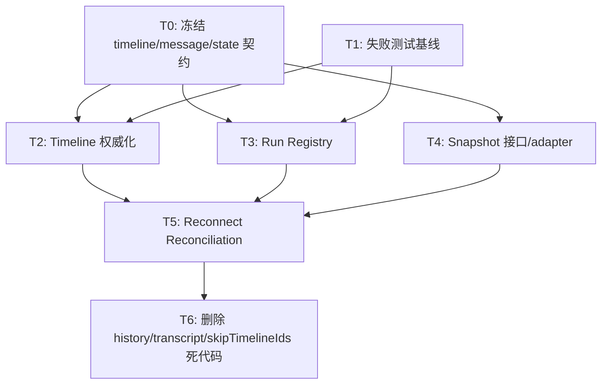

# TUI Overhaul Design

> 状态：Draft v1
> 日期：2026-06-20
> 基线：`main` 已合入 PR #230 `Improve TUI status footer and slash submit`
> 关联文档：
> - [`LOCAL_AGENT_TUI_ARCHITECTURE.md`](./LOCAL_AGENT_TUI_ARCHITECTURE.md)
> - [`AGENT_TIMELINE_REFACTOR_DESIGN.md`](./AGENT_TIMELINE_REFACTOR_DESIGN.md)
> - [`TUI_TEXTAREA_ARCHITECTURE_DESIGN.md`](./TUI_TEXTAREA_ARCHITECTURE_DESIGN.md)

## 1. 文档目标

本文用于指导 `services/local-agent/src/tui/` 的下一轮系统性改造。

这次改造不是继续修单点问题，而是重新整理 TUI 的状态边界和数据流。当前可见问题包括：

- server 已发送 `message.completed`，TUI 实时未显示，退出重进后从历史恢复可见。
- timeline、history、activeRun、runRoute 之间存在隐式一致性要求，任何一个提前变化都会导致事件丢失。
- `TuiApp` 仍承担过多职责，布局、输入路由、modal 状态、runtime lifecycle 和 dispatch 组装混在一起。
- PR #230 已把底部 Help 改成 `BottomStatusLine`，但状态栏还只是展示层合并，没有成为 TUI 状态模型的一等输出。

本文输出：

1. 当前 TUI 结构问题诊断。
2. 目标分层和数据模型。
3. 每个优化点的设计方向和验收标准。
4. 推荐实施顺序。

## 2. 当前结构摘要

当前 TUI 的主要链路：

```txt
TuiRuntimeController
  ├─ HTTP: /health /runtime /history /sessions /sessions/resume
  └─ WS: LocalAgentServerMessage
        ↓
tuiServerMessageActions
        ↓
tuiStateReducer
        ↓
TuiState
        ↓
TuiApp + Ink components
```

当前 UI 分区：

```txt
TuiApp
  ├─ Static timeline
  ├─ Dynamic timeline
  ├─ ResumePicker / GlobalReviewPolicyPicker / ApprovalPanel
  ├─ activityStatus line
  ├─ CommandPalette / FileMentionPopup
  ├─ Composer
  └─ BottomStatusLine
```

当前核心状态：

```ts
type TuiState = {
  connection: TuiConnectionState;
  sessions: Record<SessionId, SessionModel>;
  focusedSessionId: SessionId | null;
  runRoute: Record<RunId, SessionId>;
  input: TextAreaModel & { history: ComposerHistoryState };
};

type SessionModel = {
  history: HistoryCellModel[];
  timeline: AgentTimelineEntry[];
  activeRun: ActiveRunModel | null;
  tokenUsage: TokenUsageModel | null;
};
```

## 3. 核心问题诊断

### 3.1 实时路径和恢复路径不是同一套模型

实时路径：

```txt
WS event
  -> event.received
  -> runRoute[requestId]
  -> session.activeRun
  -> session.timeline / session.history
```

恢复路径：

```txt
HTTP /history
  -> session.replace_history
  -> session.history
  -> timelineEntriesFromHistory(history)
```

这意味着实时 UI 和重进后的 UI 并不是由同一个 source of truth 构建出来的。

直接后果：

- 实时事件可以因为 `runRoute` 或 `activeRun` 缺失被丢弃。
- 退出重进后，server checkpoint 里的最终消息又可以通过 `/history` 恢复。
- pending review、runtime、studio progress 等状态信息在恢复路径中无法完整还原。

### 3.2 `history` 不应并行于 `timeline`

当前 `appendHistory` 会同时写 `history` 和 `timeline`。部分实时事件直接写 `timeline`，最终 assistant 又写 `history`，再用 `skipTimelineIds` 避免重复 entry。

概念上这不成立：TUI 里应该只有一个对话事实，也就是 `timeline`。更准确地说，`timeline` 就是后端 checkpoint 中的 messages 在 TUI 中的表达，承载用户交互相关内容，例如 user message、assistant streaming/final message、tool operation message。

`history`、server checkpoint、启动恢复、当前运行中的 WS event，都只是构造或修正 `timeline` 的数据来源。

这个模型的问题：

- UI 需要猜测某个 entry 应该来自 history 还是实时事件，而不是只消费同一个 timeline。
- checkpoint、export 和 timeline rendering 的权威来源不一致。
- 调试时很难判断“消息没显示”是 history 没写、timeline 没写、还是 Static/Dynamic 分区没渲染。

目标模型中可以保留 `source` / `provenance` 元信息，例如 `snapshot`、`live-event`、`local-input`，但这些只是 timeline message 的来源标记，不应该形成一套和 timeline 并行的状态树。

### 3.3 `activeRun` 承担了过多语义

`activeRun` 目前同时表示：

- 当前是否 busy。
- 当前 requestId。
- 当前 phase。
- pending review。
- charCount。
- timelineEntryIds。

实时事件处理还要求所有 event 必须匹配当前 focused session 的 `activeRun.requestId`。

这里的问题不只是字段太多，命名也会误导理解：

- `activeRun` 听起来像完整 run 实体，但很多时候它只是 focused session 的当前 run 指针。
- `runRoute` 听起来像路由表，但它又承担 requestId 到 session 的生命周期关联。
- 两者都围绕 requestId，但没有一个清晰的 owner 来表达 request、run、session、timeline 之间的关系。

这个约束过强：terminal event，例如 `message.completed`、`error`、`interrupted`，理论上应该能完成或修正 run 状态；但当前实现中只要 `activeRun` 已经不存在，就会被丢弃。

### 3.4 `runRoute` 是易失路由，不是 run registry

`runRoute` 只保存 `requestId -> sessionId`，没有 run status、startedAt、finishedAt、lastEventAt、terminal reason 等信息。

它只能做事件路由，不能回答：

- 这个 request 是否已经 terminal？
- 这个 request 是否来自恢复中的 pending review？
- 这个 request 是否是 reconnect 前已经开始的 run？
- terminal event 到达时是否应该补写 timeline？

目标关系应更直接：

```txt
requestId == runId
run.sessionId -> 归属 session
run.timelineEntryIds -> run 影响了哪些 timeline entry
session.activeRunId -> 当前 session 的 active 指针，可为空
```

也就是说，事件路由应该从 run registry 派生；不应该同时维护一个 `runRoute` 和一个带完整语义的 `activeRun`。

### 3.5 reconnect 缺少 reconciliation

TUI 初始化时读取 `/history`，但 WS 重连后只恢复连接和 runtime config，没有重新拉取 session snapshot。

`connect` / `disconnect` 本身只表示数据通道是否可用，不应该成为另一套数据恢复模型。断线期间错过的内容、当前 timeline、pending review、active run、runtime 状态，都应该通过同一个 session snapshot 对账回来。

因此如果断线期间 server 完成了 run，TUI 不会自动补齐：

- final assistant。
- token usage。
- pending review。
- session summary。
- runtime 状态。

### 3.6 UI 分区还没有稳定的 screen model

PR #230 增加了 `BottomStatusLine`，但 `TuiApp` 仍直接拼接：

- activity status line。
- modal panels。
- command/file mention popup。
- composer。
- bottom status line。

这些分区没有统一的 `TuiScreenModel` 描述，所以布局和状态逻辑仍混在 component 内。

### 3.7 输入 owner 和 modal 状态分散

输入 owner 由 `resolveTuiInputAction` 根据一组 boolean 现场计算：

```ts
ready
busy
hasPendingApproval
hasResumePicker
hasGlobalReviewPolicyPicker
hasCommandPalette
hasFileMention
```

但这些 boolean 来自不同地方：

- reducer state。
- React local state。
- derived memo。
- refs。

这让焦点切换、modal 打开关闭、approval free text、busy interrupt 等交互难以形成可测试的统一状态机。

### 3.8 状态栏仍然是字符串拼接

`BottomStatusLine` 当前直接从 `SessionModel` 和 `status` 拼字符串：

```txt
status · Chat/Studio · 授权 · 模型 · 上下文 · 目录
```

问题：

- 没有字段优先级。
- 只按 JS string length 截断，不按 terminal display width。
- 缺少连接状态、pending review、modal、dirty input、reconnect 等明确槽位。
- 状态栏和 composer 上方 activity line 展示重复。

## 4. 目标分层

建议把 TUI 拆成四层：

```txt
protocol/client layer
  -> domain reducer
  -> screen model builder
  -> Ink components
```

### 4.1 Protocol / Client Layer

职责：

- HTTP/WS 连接。
- JSON parsing。
- server message -> typed event/control。
- snapshot 拉取。

不做：

- 不直接决定 UI 布局。
- 不直接拼 terminal 文案。
- 不直接修改 React local UI state。

建议文件：

```txt
tui/TuiRuntimeController.ts
tui/tuiLocalServerClient.ts
tui/tuiLocalWebSocketClient.ts
tui/tuiServerMessageActions.ts
```

### 4.2 Domain State Layer

职责：

- session。
- run registry。
- timeline log。
- connection/runtime。
- pending review。
- token usage。

建议模型：

```ts
type TuiDomainState = {
  connection: ConnectionModel;
  focusedSessionId: SessionId | null;
  sessions: Record<SessionId, TuiSessionModel>;
  runs: Record<RunId, TuiRunModel>;
};

type TuiSessionModel = {
  id: SessionId;
  kind: 'chat' | 'studio';
  actor: ActorModel;
  runtime: RuntimeModel;
  timeline: AgentTimelineMessage[];
  tokenUsage: TokenUsageModel | null;
};

type TuiRunModel = {
  requestId: RunId;
  sessionId: SessionId;
  kind: 'chat' | 'studio';
  phase: 'starting' | 'thinking' | 'using_tool' | 'streaming' | 'waiting_human' | 'interrupting' | 'completed' | 'failed' | 'interrupted';
  startedAt: number;
  updatedAt: number;
  finishedAt?: number;
  pendingReview?: ApprovalRequestModel;
};
```

### 4.3 UI State Layer

职责：

- input draft。
- focused owner。
- modal/picker state。
- selection index。
- external editor state。
- viewport/static rendering epoch。

建议模型：

```ts
type TuiUiState = {
  input: TextAreaModel & { history: ComposerHistoryState };
  overlays: {
    resumePicker?: ResumePickerState;
    globalReviewPolicyPicker?: GlobalReviewPolicyPickerState;
    approval?: ApprovalUiState;
    commandPalette?: CommandPaletteUiState;
    fileMention?: FileMentionUiState;
  };
  studio: {
    mode: 'chat' | 'studio';
    conversationId: string | null;
  };
  viewport: {
    renderEpoch: number;
    width: number;
    height: number;
  };
};
```

### 4.4 Screen Model Layer

职责：

- 把 domain + UI state 转成稳定的展示模型。
- 控制 screen 分区。
- 决定状态栏字段和优先级。

建议入口：

```ts
function buildTuiScreenModel(domain: TuiDomainState, ui: TuiUiState): TuiScreenModel;
```

建议输出：

```ts
type TuiScreenModel = {
  timeline: {
    staticEntries: AgentTimelineEntry[];
    dynamicEntries: AgentTimelineEntry[];
  };
  overlay: OverlayModel | null;
  composer: ComposerModel;
  statusBar: StatusBarModel;
};
```

`TuiApp` 应主要消费 `TuiScreenModel`，而不是直接读取一堆 selector 和 local state。

## 5. 优化点设计

### 5.1 统一实时和恢复路径

目标：启动、重连、resume 都走同一套 `session.snapshot.loaded` action。

建议新增 server snapshot 概念。snapshot 是恢复当前 TUI 事实的权威输入，核心产物分两类：

- `timeline`：后端 checkpoint messages，也就是用户交互相关消息。
- `state`：pending review、runtime、active run、token usage、connection 等状态。

它不是一份 timeline 再加一份并行的 `history` / `transcript`：

```ts
type TuiSessionSnapshot = {
  session: ResumeSessionSummary;
  timeline: AgentTimelineMessage[];
  runs: TuiRunSnapshot[];
  activeRunId?: RunId;
  pendingReview?: ApprovalRequestModel;
  runtime?: RuntimeModel;
  tokenUsage?: TokenUsageModel;
};
```

启动恢复、WS 重连、resume 都应该把 snapshot 合并进同一套 `session + runs + timeline + ui` 状态。

`timeline` 本身就是 checkpoint messages，不需要再引入 `transcript` 作为中间视图。server 如果现阶段提供的是 `/history`，也应该把它当作 checkpoint messages 的读取入口，在 adapter 层转成同一种 `AgentTimelineMessage[]` 后再进入 `session.snapshot.loaded` reducer。

客户端动作：

```ts
{ type: 'session.snapshot.loaded'; snapshot: TuiSessionSnapshot; source: 'startup' | 'reconnect' | 'resume' }
```

验收标准：

- TUI 启动、重连、resume 使用同一个 reducer 分支。
- server 已完成但 WS 事件错过时，重连后自动补 final assistant。
- pending review 可以在重连后恢复成审批面板。

### 5.2 用 run registry 替代单一 `activeRun`

目标：`requestId` 的状态由 `runs[requestId]` 管理，focused session 只保存当前 active run 指针。

建议：

```ts
type TuiSessionModel = {
  activeRunId?: RunId;
  timeline: AgentTimelineEntry[];
};
```

命名上应区分实体和指针：

- `runs[runId]` 是 run 实体，包含 sessionId、status、phase、pendingReview、timelineEntryIds。
- `session.activeRunId` 是 session 上的 active 指针。
- 不再保留独立的 `runRoute`；事件路由通过 `runs[runId].sessionId` 得到。

事件处理：

- `run.started` 创建 `runs[requestId]`。
- `message.delta` 更新 run phase 和 timeline。
- `message.completed` terminalize run，即使 focused active pointer 已经变化，也可以按 `runs[requestId].sessionId` 找回 session。
- `error` / `interrupted` 也走 terminalize。

验收标准：

- terminal events 不依赖 `session.activeRun` 存在才能落 UI。
- stale event 可以基于 run terminal state 明确忽略，而不是因为状态缺失静默丢弃。
- active operation、pending approval、busy state 都从 run registry 派生。

### 5.3 让 timeline 成为唯一消息日志

目标：TUI 中用户交互相关内容只读 timeline。历史恢复、实时事件、本地输入、server checkpoint 都只是 timeline messages 的来源。

建议：

- `AgentTimelineMessage` 对齐后端 checkpoint messages。
- timeline 覆盖 user message、assistant streaming/final message、tool operation message。
- `history` 字段从 live session state 中移除。旧 `/history` 输入在 adapter 层转成 timeline messages。
- 重构必须去掉 `transcript` / message-only view / `transcriptSnapshot` 这类中间模型；timeline 本身就是 messages。
- 如需调试来源，在 timeline message 上保留轻量 `source` / `provenance`，例如 `snapshot`、`live-event`、`local-input`。

写入规则：

```txt
user submit        -> append message entry(role=user)
message.delta      -> append/update assistant streaming entry
message.completed  -> finalize assistant entry
tool operation     -> append/update tool operation message
review event       -> update pendingReview state, not timeline
runtime event      -> update runtime state, not timeline
studio progress    -> update studio/run state, not timeline
error              -> terminalize run + update error state; append timeline only if server checkpoint has an error message
```

验收标准：

- 不再需要 `skipTimelineIds`。
- final assistant 不再同时写 history 和 timeline。
- live state 中不存在 `history` / `transcript` / `transcriptSnapshot` 等第二份消息日志。
- checkpoint messages、实时流式消息、恢复后的 timeline 使用同一种 message model。

### 5.4 重做 reconciliation 策略

目标：所有可能丢事件的地方都通过同一个 session snapshot 对账。`connect` / `disconnect` 只表达数据通道是否可用，不表达数据事实本身。

对账触发：

- initial startup。
- WS reconnect open。
- `/resume` 完成。
- interrupt timeout 后。
- server 返回 stale review / closed review。

对账内容：

- active session id。
- timeline snapshot。
- pending review。
- runtime。
- token usage。
- active run status。

验收标准：

- 断网期间 run 完成，重连后 TUI 自动显示最终结果。
- 断网期间进入 HITL，重连后 TUI 显示 approval panel。
- session reset/resume 不留下旧 requestId route。

### 5.5 状态栏改为结构化模型

目标：`BottomStatusLine` 不再直接拼 `SessionModel`，而是渲染 `StatusBarModel`。

建议：

```ts
type StatusBarModel = {
  activity: StatusSegment;
  mode: StatusSegment;
  connection: StatusSegment;
  policy: StatusSegment;
  model: StatusSegment;
  context: StatusSegment;
  cwd: StatusSegment;
  overlay?: StatusSegment;
};

type StatusSegment = {
  label?: string;
  value: string;
  priority: number;
  tone?: 'normal' | 'muted' | 'warning' | 'error';
};
```

渲染规则：

- 用 terminal display width 截断。
- 窄屏按 priority 删除低优先级 segment。
- activity 是唯一当前运行状态展示；移除 composer 上方重复 status line。
- overlay 打开时显示当前 owner，例如 `Resume` / `Policy` / `Approval`。

验收标准：

- 80 列、120 列、中文 cwd 下状态栏不溢出。
- busy / approval / reconnect / disconnected 都有明确状态。
- 没有重复 activity status。

### 5.6 固化 Screen Layout 分区

目标：`TuiApp` 只渲染固定 screen regions。

建议分区：

```txt
TimelineViewport
OverlayLayer
ComposerPanel
StatusBar
```

说明：

- `TimelineViewport` 只负责 timeline static/dynamic rendering。
- `OverlayLayer` 只显示当前最高优先级 overlay。
- `ComposerPanel` 只显示输入或 busy disabled input。
- `StatusBar` 永远在最底部。

验收标准：

- `TuiApp` 不再直接组装每个 picker 的业务数据。
- 添加新 overlay 不需要改全局输入 owner 之外的布局结构。
- 状态栏永远最后一行。

### 5.7 输入 owner 收敛到 UI reducer

目标：输入归属是状态机，不是一组分散 boolean。

建议：

```ts
type TuiInputOwner =
  | 'unready'
  | 'busy'
  | 'composer'
  | 'approval'
  | 'resumePicker'
  | 'policyPicker'
  | 'commandPalette'
  | 'fileMention'
  | 'externalEditor';
```

`buildInputOwner(domain, ui)` 是纯函数。`useInput` 只做：

```txt
raw terminal input
  -> canonical input event
  -> input owner
  -> input command
  -> dispatch / runtime command
```

验收标准：

- owner 决策有单元测试矩阵。
- modal 打开/关闭不依赖多个 local state 手工同步。
- approval free text 与 composer textarea 共用 engine，但 owner 明确。

### 5.8 Studio / Chat 模式统一

目标：Studio 模式不再同时存在 React ref、React state、session.kind 三份状态。

建议：

- `ui.studio.mode` 管当前输入将提交到 chat 还是 studio。
- `session.kind` 表示当前会话展示类型。
- `TuiRunModel.kind` 表示某个 request 的运行类型。

验收标准：

- `/studio`、`/chat`、`/resume`、`/new` 后 mode 状态不冲突。
- Studio conversation id 只保存在一个地方。
- 状态栏 mode 与实际 submit target 一致。

### 5.9 Timeline Static/Dynamic 策略降复杂度

目标：保留减少闪烁的能力，但把 static/dynamic 切分变成 screen model 的一部分。

建议：

- `buildTimelineViewportModel` 统一派生 display entries 与 static/dynamic viewport。
- screen model 输出 static/dynamic。
- entry 从 streaming -> completed 时，由 screen model 负责处理 epoch/scroll 策略。

验收标准：

- completed 后 entry 不会消失或重复。
- operation running/completed 转换稳定。
- resize 不破坏 static timeline。

## 6. 推荐实施顺序

### Phase 1：文档和测试基线

- 新增当前文档。
- 增加覆盖现有问题的失败用例，不先改实现：
  - completed sent but activeRun missing。
  - reconnect after server completion。
  - resume clears route。
  - pending review reconnect。
- 记录当前行为与目标行为差异。

### Phase 2：StatusBar / ScreenModel

- 引入 `StatusBarModel`。
- 引入 `buildTuiScreenModel`。
- 移除 composer 上方重复 activity line。
- `BottomStatusLine` 改为渲染 model。

这是低风险 UI 层整理，可以先落地，给后续状态改造提供稳定边界。

### Phase 3：Run Registry

- 从 `SessionModel.activeRun` 迁移到 `runs[requestId] + activeRunId`。
- terminal event 改为按 run registry terminalize。
- busy、approval、active operations 从 run registry 派生。

### Phase 4：Timeline 权威化

- 移除 live `history` 和 `timeline` 双写。
- 将 `/history`、checkpoint messages、实时 WS event、本地 submit 都收敛为 timeline message 输入来源。
- `skipTimelineIds` 退出。
- 删除 `transcript` / message-only view / `transcriptSnapshot` 相关中间模型和 selector。

### Phase 5：Snapshot / Reconciliation

- server 增加或复用 snapshot endpoint。
- snapshot 返回当前 timeline、runs、pending review、runtime、usage 等完整 TUI 状态。
- startup/reconnect/resume 统一走 `session.snapshot.loaded`。
- reconnect 只作为 snapshot 对账触发器，不拥有独立恢复逻辑。
- pending review 恢复。

### Phase 6：Input/UI State 收敛

- modal state 收进 reducer。
- studio mode 收进 reducer。
- input owner 纯函数化。
- `TuiApp` 收敛成 thin shell。

## 7. 任务拆分与依赖关系

### 7.1 阻塞主链

真正阻塞后续重构的是状态契约，不是 UI 细节：



阻塞说明：

- `T0` 必须先落：明确 `timeline == backend checkpoint messages`，pending review、runtime、usage、studio progress 都是状态；不得引入 `transcript` / message-only view。
- `T1` 不改变实现，但应该先落测试，避免后续重构只能靠手动 TUI 观察。
- `T2` 和 `T3` 是核心状态改造。两者都依赖 `T0`，且都会碰 reducer / action / selector，概念上可并行，合并上建议串行。
- `T5` 必须等 `T2 + T3 + T4`，否则 reconnect 只能继续补丁式处理，不能统一对账。
- `T6` 只能在 `T2/T5` 后做，避免提前删掉现有恢复路径导致 TUI 断档。

### 7.2 可并行任务

这些任务可以和阻塞主链并行推进：

| 任务 | 内容 | 依赖 | 并行风险 |
| --- | --- | --- | --- |
| `P1` StatusBar Model | `BottomStatusLine` 改成结构化 `StatusBarModel` 渲染 | 无强依赖 | 低，主要改 UI component |
| `P2` ScreenModel | 引入 `buildTuiScreenModel`，让 `TuiApp` 消费展示模型 | 无强依赖 | 中，会碰 `TuiApp` selectors |
| `P3` Layout 分区 | 固化 timeline / overlay / composer / status bar 分区 | `P2` 最好先落 | 中，可能和输入改造冲突 |
| `P4` 输入 owner 梳理 | modal、picker、external editor、composer owner 收敛 | `P2` 后更稳 | 中高，会碰 `TuiApp` 和输入 router |
| `P5` Studio/Chat mode | `ui.studio.mode` 统一，避免 ref/state/session 三份状态 | `P2` 后更稳 | 中 |
| `P6` Static/Dynamic timeline 简化 | 降低 timeline viewport 分区复杂度 | `T2` + `P2` | 中，依赖 timeline message model |
| `P7` Server snapshot 草案 | 定义 `/tui/snapshot` 或复用 endpoint 的返回 shape | `T0` | 低到中，先做 contract 不接 reducer |

### 7.3 推荐 PR 切分

不要把所有任务排成一个线性队列。核心状态重构和 UI 边界整理应该分 track 管理。

核心阻塞链按下面顺序合并：

1. `CORE-1`：契约和测试基线。冻结 `timeline == backend checkpoint messages`，补失败/目标测试，不做大规模 runtime 迁移。
2. `CORE-2`：Timeline 权威化。移除 live `history` 双写，把 `/history` / checkpoint / WS event 收敛到 `AgentTimelineMessage[]`。
3. `CORE-3`：Run Registry。用 `runs[runId] + session.activeRunId` 替代 `activeRun + runRoute`。
4. `CORE-4`：Snapshot Adapter。定义并接入 `session.snapshot.loaded`，snapshot 合并 `timeline + runs + state`。
5. `CORE-5`：Reconnect Reconciliation。重连、startup、resume 全走 snapshot 对账，修复 missed completed / pending review。
6. `CORE-6`：清理。删除 `history` / `transcript` / `transcriptSnapshot` / `skipTimelineIds` 相关残留 selector、helper、测试 fixture。

可以并行的 UI / contract track：

| Track | PR | 内容 | 何时可合 |
| --- | --- | --- | --- |
| `UI` | `UI-1` | StatusBar Model | 设计 PR 合入后即可 |
| `UI` | `UI-2` | ScreenModel + layout regions | `UI-1` 后更稳，也可独立 |
| `UI` | `UI-3` | Input owner + Studio/Chat mode | `UI-2` 后 |
| `UI` | `UI-4` | Static/Dynamic timeline viewport 简化 | `CORE-2 + UI-2` 后 |
| `CONTRACT` | `CONTRACT-1` | Server snapshot contract 草案 | `CORE-1` 后，可早于实现 |

`UI-*` 不应该插进 `CORE-*` 的顺序里。它们可以并行开发，但实现 PR 描述里要明确依赖哪个 core contract，避免 UI 层提前固化旧的 `history/activeRun/runRoute` 模型。

## 8. 测试矩阵

最低测试覆盖：

| 场景 | 期望 |
| --- | --- |
| chat 正常流式完成 | delta 显示，completed finalize，同步 token usage |
| 无 delta 只有 completed | 创建 completed assistant entry |
| completed 到达时 active pointer 已清理 | run registry terminalize 或明确忽略并对账 |
| WS 断线期间 server 完成 | reconnect snapshot 补 final assistant |
| WS 断线期间 server 等待 approval | reconnect snapshot 显示 approval panel |
| interrupt timeout | UI 释放输入，但后续 server terminal event 不造成重复或丢失 |
| resume session | route/run/ui/modal 状态全部清理，timeline 来自 snapshot |
| /new session | 旧 route/run 不污染新 session |
| /studio -> /chat -> /resume | mode、session kind、status bar 一致 |
| 窄屏状态栏 | 按 priority 截断，不破坏 CJK 宽度 |

## 9. 非目标

本轮不处理：

- 更换 Ink 或引入 OpenTUI。
- 重写 local-agent server runtime。
- 改 `LocalAgentEvent` 的公共语义，除非 snapshot/reconciliation 明确需要扩展。
- 做移动 app UI。

## 10. 开放问题

1. server snapshot 是否应该新增 `/tui/snapshot`，还是扩展现有 `/history` / `/runtime` / pending review 接口？
2. timeline message model 是否可以直接复用后端 checkpoint message 类型，还是需要一层 TUI render adapter？
3. token usage 应该来自 `message.completed.usage`，还是独立 runtime usage endpoint？
4. Studio progress 在恢复路径中是否需要完整可见，还是只保留最终 studio response？
5. 状态栏字段在 80 列以下的优先级是否固定为：activity > mode > connection > context > model > cwd > policy？

## 11. 一句话原则

后续 TUI 代码改造应遵守：

```txt
实时事件、历史恢复、重连对账，都必须收敛到同一个 session/run/timeline 状态模型。
```
