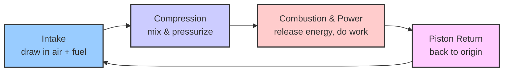
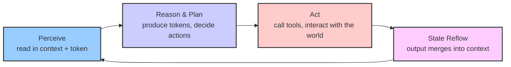

# Why an Agent Harness

This explanation preserves the project vision from the repository README. For
the implemented system boundaries, read [Architecture](architecture.md).

### The "Engine" of the Intelligence Revolution

The Industrial Revolution began when humanity started understanding "energy."

At first, we harnessed diffuse natural forces—wind and water—but energy density was low and uncontrollable. Then we learned to extract high-density energy (coal, petroleum) and kept finding more efficient ways to use it. The **engine** is the technical crystallization of this progress: it transforms high-density energy into controllable, composable, mass-producible mechanical power. The principle of an engine is not complicated, but different engines suit different scenarios—cars use four-cylinder internal combustion engines, power plants use steam turbines, aircraft use jet engines. The engine itself is only the beginning; you still need to attach driveshafts, wheels, and control systems before that energy can truly create value.

We are living through a parallel transformation—the **Intelligence Revolution**.

Humans have always possessed natural intelligence, but its density is low—constrained by individuals, time, and the cost of transmission. Large Language Models (LLMs) let us, for the first time, produce intelligence at scale through energy. The question follows: how do we make this high-density intelligence run efficiently and create value? That is precisely the question **agent (harness)** answers. If the LLM is the source of high-density intelligence, then the agent harness is the "engine" of this Intelligence Revolution—it determines how intelligence is organized, dispatched, constrained, and released.

Like the engine, the principle of agent harness is not mysterious, but different scenarios demand different forms: a personal assistant is a "four-cylinder engine," enterprise-grade multi-agent collaboration is a "steam turbine." And just as an engine needs wheels and control systems on top of it, an agent harness needs tools, transports, storage, and human-machine interaction layered on top.

The two cycle diagrams below illustrate this parallel—the left shows how an engine continuously turns energy into power, the right shows how an agent continuously turns intelligence into value:

| Engine | Agent | Shared Role |
|---|---|---|
| Intake (draw in air + fuel) | Perceive (read in context + token) | Draw in raw material |
| Compression (mix & pressurize) | Reason & plan (organize intelligence) | Compress & organize |
| Combustion & power (release energy, do work) | Act (call tools, interact with the world) | Core work |
| Piston return (back to origin) | State reflow (output merges into context) | Close the loop |
| → back to intake | → back to perceive | Cycle repeats |

### The Essence of the Loop: Energy + Air vs Token + Context

Both diagrams above are **cycles**, not one-shot pipelines. The real power of an engine or agent comes from **the loop**—a continuous cycle, not a single transformation.

An engine draws in air, mixes it with fuel, combusts, the piston does work and outputs power, then returns to its starting position as fresh air rushes in to begin the next cycle. The key insight: each stroke is not isolated; energy is continuously released across cycles.

An agent works the same way. It reads in context (user intent, conversation history, tool feedback), mixes it with tokens (the LLM's reasoning capability), and produces new tokens—perhaps an answer, perhaps a tool call. The output is not discarded; it becomes new context fed back into the next cycle. Each round of reasoning builds on the accumulated results of the previous round; intelligence iteratively converges toward the goal within the loop.
After doing its work, the state flows back—just as a piston returns to its origin after the power stroke to prepare for the next intake. It is not about "exhausting" anything; it is about closing the loop.

This is the core responsibility of an agent harness: **keep the loop running stably**. Engine engineering is the precise coordination of intake / compression / combustion / cooling; agent engineering is the precise coordination of context management, token scheduling, tool execution, feedback integration, and state persistence. The more stable, fast, and long-running the loop, the greater the value created.

**PinPawo Agent explores exactly the engineering path of the "engine" in this Intelligence Revolution**: we study what technologies can efficiently organize intelligence, how to make agents run reliably across different scenarios, and how to translate LLM capability into deliverable value. This repository is our public practice—runtime, Capability, Toolkit, Studio coordination, local host, and developer tooling are all parts of this "engine."
