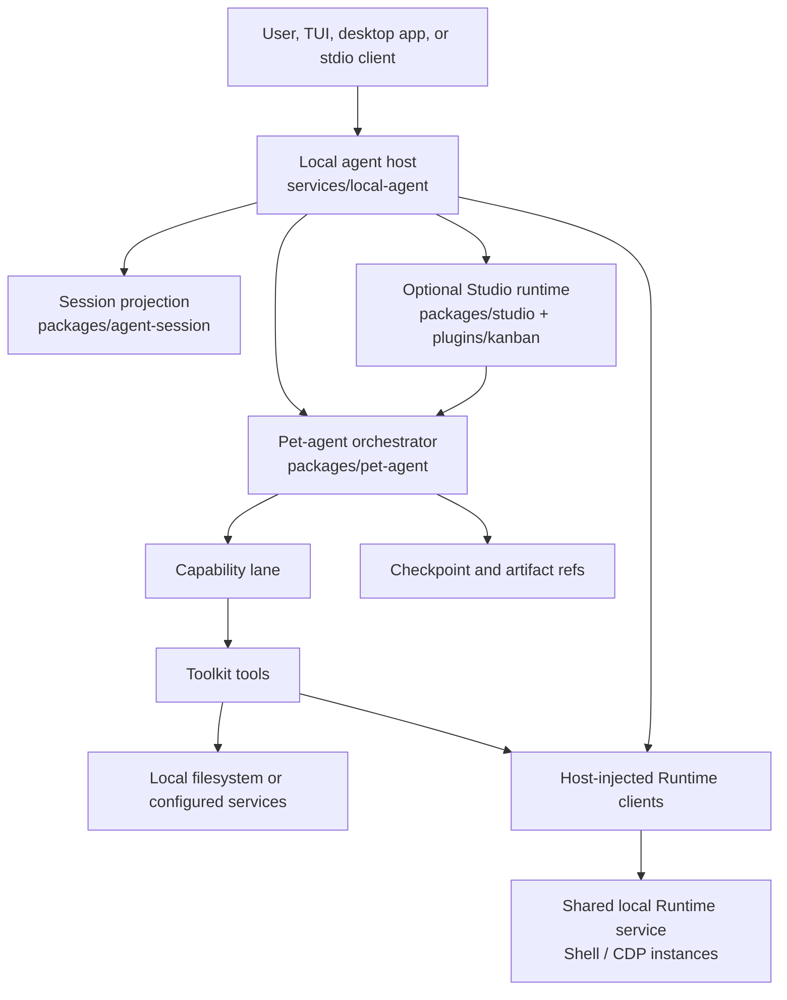

# Architecture

> **Status: current conceptual guide.** For type-level contracts, follow the
> links into [Reference](../reference/index.md).

[简体中文](../zh-CN/concepts/architecture.md)

PinPawo Agent is an open-source, local-first agent stack. It separates
orchestration, task authority, tool execution, user review, and durable state so
each concern can evolve independently and remain observable.

For the terminology behind this design, start with [Core Concepts](core-concepts.md).

## Design goals

The architecture is optimized for five practical needs of production agent
systems:

1. **Keep users in control.** Local-machine Toolkit operations and browser
   sessions stay on the machine that runs the agent; review policy can stop
   risky work for approval.
2. **Make authority visible.** Capabilities declare their Toolkit dependencies
   statically, so the available tool surface is explicit per task.
3. **Support real, multi-step work.** Checkpoints, structured events, and
   session snapshots let a client recover after disconnection or review.
4. **Stay extensible without forking the runtime.** Markdown Capabilities and
   typed Toolkits let contributors add domain behavior at the correct boundary.
5. **Scale from one agent to a team.** Studio adds a shared dispatch channel
   and plugin boundary without a global prompt or shared scratchpad.

## System map



The local host is the integration boundary. It resolves configuration, connects
to the shared Runtime service, exposes HTTP/WebSocket or JSONL stdio transports,
and composes the Capability registry. Host startup starts the service if needed.
Runtime-independent orchestration stays in
`packages/pet-agent`; host-specific integrations remain in `services/` and
`toolkits/`.

The definition chain is `Host -> Agent -> Capability -> Toolkit -> ToolDefinition`;
the orchestrator and subagent lanes are internal to Agent. Runtime resources have
a separate owner: the independent local Runtime service. A Toolkit declares a
dependency such as `runtime: 'shell'` or `runtime: 'cdp'`; the Host injects a client
and each Capability receives only the clients selected by its `uses` declaration.
Tool objects remain static across executions.

Runtime instances need not be unique to a Toolkit. By default bash, Git and
project-inspection share one Shell environment; operators can instead map them
to separate instances. A Shell environment supplies configured shell/CLI
execution and process ownership, without requiring one permanent shell process.
See the [Runtime contract](../reference/extensions/toolkit-runtime.md) and the
updated [domain and assembly constraints](../design/host-agent-capability-toolkit.md).

## Main packages

| Area | Location | Responsibility |
|---|---|---|
| Contracts | `packages/agent-contracts/` | Shared request, event, review, and run contracts. |
| Orchestration | `packages/pet-agent/` | Agent graph, Capability planning, lane isolation, review integration, and artifact references. |
| Session state | `packages/agent-session/` | Client-neutral session model, reducers, versioned snapshots, and parsers. |
| Collaboration | `packages/studio/` | Studio Host, dispatch, read-only per-Pet dispatch-queue observation (including admission state), and the standalone process entry. |
| Local host and Runtime service | `services/local-agent/` | CLI, Host client assembly, independently hosted execution environments, and local transports. |
| Terminal UI | `services/tui/` | OpenTUI client and packaged distribution. |
| Tool integrations | `toolkits/` and `plugins/` | CDP Browser Toolkit and reusable Plugin-defined Toolkits such as Kanban; runtime dependencies are explicit. |
| Desktop companion | `tools/agent-macos/` | Suspended; outside the active integration scope. |

## Request lifecycle

```text
1. A client submits a user request to the local host.
2. The host composes a registry from enabled Capabilities and available Toolkits.
3. The orchestrator either answers directly or selects one bounded execution lane.
4. The lane can use only the Toolkits declared by its Capability.
5. Tool input is prepared against the trusted execution scope before policy proceeds, requests review, or blocks it.
6. The completed result returns to the main conversation.
7. A Capability writes an artifact reference only for output that must persist.
8. The session projection reports durable and live state to connected clients.
```

This flow is designed to avoid two common failure modes: broad tool access
granted through prompt wording, and UI clients trying to reconstruct durable
state from a transient tool-event stream.

## State ownership

| State | Owner | Boundary rule |
|---|---|---|
| Conversation messages and pending continuation | LangGraph checkpoint | Durable authority for resume and review. |
| Current client view | Session projection | A materialized view; never a second conversation store. |
| Capability scratch work | Subagent lane | Private to the selected unit of work. |
| Cross-lane output | Artifact store | Passed as references, not copied through every message. |
| Execution settings and workdir | Local host | Resolved before invocation and supplied explicitly to the Agent. |
| Runtime instance configuration | Shared local Runtime service | Read at service startup; Toolkit bindings choose shared or separate environments. |
| Shell processes and CDP resources | Shared local Runtime service | Access is scoped to a client, Toolkit and execution/session identity. Closing one Host releases its resources; only explicit service shutdown stops the shared service. |
| Studio dispatch delivery | Per-Pet invocation queue | Queue is process-local; active thread and checkpoint continuity belong to the resident Pet's Agent Session. |

## Deployment modes

| Mode | Use when | Entry point |
|---|---|---|
| Interactive local agent | A person works directly in the terminal. | `pinpawo tui` |
| Local server | Another local UI or app needs an HTTP/WebSocket host. | `pinpawo server` |
| JSONL stdio | A process integration needs one transport-safe peer. | `pinpawo server --stdio` |
| Studio | A Plugin-driven control plane dispatches work across resident Pets. | `pinpawo-studio [--pet-port <port>]` |

## Extension model

Contributors normally extend the project in one of two ways:

- Add a **Capability** when the extension defines a new user-facing task,
  instructions, and a fixed Toolkit allowlist.
- Add a **Toolkit** when the extension supplies reusable tools, availability
  checks, runtime dependency declarations, operation metadata, or review policy.

A Capability is authored as `CAPABILITY.md` with optional narrowly scoped code
for `lifecycle.finalize`. A Toolkit is always typed code. See the
[Capability / Toolkit V2 contract](../reference/extensions/capability-toolkit.md) and
[Capability directory protocol](../reference/extensions/capability-directory.md).

## Security and privacy boundaries

- Browser automation uses CDP with approved-origin checks. The service owns its
  pages and does not adopt existing user tabs; borrowed browsers are left running.
- Toolkits carry review guidance and tools may require human authorization.
- Input preparation runs before review. Authorization reuse is scoped to the
  Toolkit, client connection, instance and workdir, so changing a target cannot
  reuse a grant from the previous environment.
- Local configuration, credentials, and checkpoint storage stay outside client
  protocol payloads.
- Artifact references prevent large files or private lane transcripts from
  becoming ordinary conversation content.

For Browser-specific setup and limits, read
[CDP browser guide](../guides/browser-bridge.md).

## Next steps

- [Getting started](../guides/getting-started.md) — run the local host.
- [Core Concepts](core-concepts.md) — understand the user-facing model.
- [API reference](../reference/api/index.md) — programming and protocol
  reference.
- [Studio](../studio/index.md) — multi-agent coordination and configuration.
