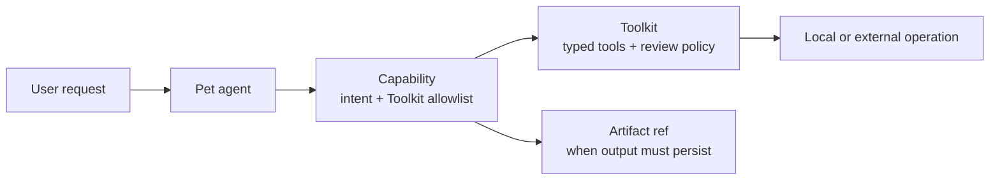

# Core Concepts

> **Status: current conceptual guide.** This page defines stable vocabulary;
> linked reference pages own the detailed implementation contracts.

[简体中文](../zh-CN/concepts/core-concepts.md)

PinPawo Agent is a local-first framework for building and operating agents that
can reason, use tools, ask for approval, and delegate focused work without
turning the whole system into one opaque prompt.

This page is the conceptual entry point for the open-source project. It explains
the stable vocabulary used across the runtime, CLI, APIs, and extension model.
For the system map, see [Architecture](architecture.md).

## What the project gives you

PinPawo Agent helps you build agents with clear operational boundaries:

- **Local control.** The host, tools, sessions, and optional browser bridge run
  on the user's machine. You choose the LLM provider and endpoint.
- **Explicit authority.** A Capability declares exactly which Toolkits it may
  use; side-effecting tool calls can be held behind human review.
- **Recoverable execution.** Checkpoints preserve conversational state and
  pending review work, while clients consume a stable session projection.
- **Composable extensions.** Add task-specific Capabilities as Markdown and
  reusable implementation Toolkits as typed code.
- **Scalable collaboration.** Studio coordinates multiple pet runtimes through
  a task queue and shared conversation knowledge, without exposing each agent's
  private working state to every other agent.

## The core vocabulary

| Concept | Meaning | Why it matters |
|---|---|---|
| **Host** | The product or process boundary that resolves configuration, selects Capability and Toolkit definitions, owns Agent runtimes, and manages Toolkit runtime lifetime. | It keeps machine, transport, and lifecycle concerns outside the Agent graph. |
| **Pet agent** | One configured Agent runtime with an actor identity, models, Capabilities, compiled Toolkit bindings, and state. | It is the unit that receives an invocation and produces a user-visible result. |
| **Capability** | A focused, delegable unit of work with instructions and a fixed Toolkit allowlist. | It makes routing and tool authority inspectable instead of implicit in a large prompt. |
| **Toolkit** | A typed family of executable tools, operation metadata, availability checks, review policy, and an optional Toolkit Runtime. | It centralizes implementation, safety rules, and dynamic resource ownership for a reusable tool family. |
| **Subagent lane** | The short-lived private execution context used for one selected Capability or general task. | It keeps task-specific reasoning isolated from the main conversation. |
| **Human review** | The interrupt-and-resume boundary for actions that require user authorization or input. | Approval is a runtime contract, not a convention hidden in an instruction. |
| **Checkpoint** | Durable LangGraph state for messages and pending continuation. | It is the authority for resume and recovery. |
| **Session projection** | The client-neutral view of a checkpoint plus current runtime facts. | TUI and remote clients share one presentation contract without each rebuilding state. |
| **Artifact** | A durable reference to a Capability output that must outlive its private lane. | It moves files and structured results across boundaries without treating chat messages as storage. |
| **Studio** | The multi-pet run controller, task queue, and conversation-wiki coordinator. | It adds collaboration while preserving each worker's local execution boundary. |
| **Workdir** | The local scope for runtime configuration, Studio state, and relative tool paths. | It prevents unrelated projects from sharing runtime state accidentally. |

## Canonical detail by concept

This page intentionally gives each concept one short definition. Use the
following pages when you need a contract or implementation boundary:

| Concept area | Canonical detail |
|---|---|
| Capability and Toolkit authority | [Capability / Toolkit contract](../reference/extensions/capability-toolkit.md) |
| Review and authorization reuse | [Events and human review](../reference/api/events-and-review.md) and [Authorization matcher](../reference/runtime/authorization-matcher.md) |
| Checkpoint, session, snapshot, and timeline | [Session projection](../reference/runtime/session-projection.md) |
| Durable cross-lane results | [Capability Artifact Pipeline](../reference/artifacts/index.md) |
| Workdir and runtime configuration | [Workdir configuration](../reference/runtime/workdir.md) |
| Multi-agent coordination | [Studio](../studio/index.md) |

## The three extension boundaries



1. A **Capability** describes the task and names the Toolkits it is allowed to
   use.
2. A **Toolkit** provides the executable tools and their operational policy.
3. An **Artifact** is used only when a result must cross an execution boundary
   or survive lane cleanup.

This separation is intentional: Markdown instructions are easy to review and
ship, while executable tools and side effects remain in typed code.

Host and Agent are ownership boundaries, not additional extension formats. A
Host creates and retains one or more Agent runtimes; an Agent executes a
Capability; the Capability names its Toolkits; and any Toolkit Runtime remains
subordinate to that Toolkit. The accepted cross-host constraints are recorded
in [Host / Agent / Capability / Toolkit relationships](../design/host-agent-capability-toolkit.md).

## The execution model

A user request does not automatically grant every tool to every model call.
The runtime follows this shape:

```text
request
  -> Entry Answer replies directly or routes an executable goal
  -> Run Supervisor selects and steers the Capability plan
  -> selected work runs in an isolated lane
  -> Toolkit tools execute under their declared policy
  -> optional human review interrupts and resumes the run
  -> result is handed back to the main conversation
  -> optional artifact reference preserves durable output
```

The important invariant is that the main conversation receives the completed
result, not the entire private scratchpad and tool transcript. This limits
context growth while keeping the final answer grounded in completed work.

## Checkpoints, sessions, and timelines

These terms are deliberately different:

- A **checkpoint** is durable runtime authority.
- A **session projection** is the current client-safe representation of that
  authority.
- A **timeline** is a UI structure that can show live operations between
  checkpoints.

The [Local-agent session projection](../reference/runtime/session-projection.md) defines
the current protocol and replacement rules in detail.

## Studio collaboration

Studio is for work that benefits from several specialized agents. It owns the
shared dispatch channel: a Pet registry, one queue per Pet, runtime-gate
observation, and an in-process plugin event bus. A planner, task board, or
scheduler is a plugin or Pet concern; Studio does not store task state, infer
completion, or own shared knowledge.

Studio does not become a second tool executor or a shared private scratchpad.
Read the [Studio overview](../studio/index.md) for the current runtime boundary.

## Where to go next

- [Architecture](architecture.md) — how the packages and runtime boundaries fit
  together.
- [Getting started](../guides/getting-started.md) — install the CLI, configure a model,
  and run the local agent.
- [Capability / Toolkit V2 contract](../reference/extensions/capability-toolkit.md) —
  build a Capability or Toolkit.
- [Local-agent session projection](../reference/runtime/session-projection.md) — build a
  client or understand recovery behavior.
