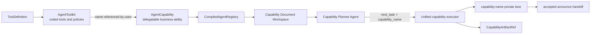

# Capability / Toolkit V2 Architecture

## Current synthesis

Capability and Toolkit are the two extension concepts. The orchestrator,
subagent, registry, lane, artifact store, and review middleware are framework
mechanisms around them; they are not additional author-facing ability types.



The stable authoring relation is:

```text
Capability describes what to accomplish
Toolkit supplies how the subagent can act
uses composes the two and defines permission
orchestrator decides when each Capability runs
```

## Stable vocabulary

| Term | Meaning | Not |
|---|---|---|
| `ToolDefinition` | One executable Structured Tool plus optional operation metadata and review policy | A route, plugin, or independent permission grant |
| `AgentToolkit` | A coded family of tools, tool instructions, availability, and review guidance | A delegatable skill |
| `AgentCapability` | A named business executor with description, required `uses`, Markdown instructions, and optional deterministic finalize lifecycle | A tool container or nested orchestrator |
| `CompiledCapability` | The immutable registry-generation binding of one Capability to its resolved Toolkits, tools, and captured tool names | A third extension contract |
| `general` | A well-known ordinary Capability selected by Planner policy when no specialist fits | A special executor, lane, or registry slot |

**Fact:** The public contracts are defined in
[`types/capability.ts`](../../packages/pet-agent/src/types/capability.ts) and
[`types/toolkit.ts`](../../packages/pet-agent/src/types/toolkit.ts). The
compiler in
[`registry.ts`](../../packages/pet-agent/src/agent/orchestrator/registry.ts)
produces the execution inventory consumed by workspace publication and
execution.

## Accepted composition decision

**Decision:** Capability does not extend Capability. Reusable executable
behavior belongs in Toolkit and is composed through static `uses`.

This keeps four meanings separate:

- Capability description owns routing intent.
- Capability Markdown owns business execution instructions.
- Toolkit owns coded actions and tool-level policy.
- Orchestrator owns sequencing between separate Capability executions.

Inheritance would implicitly mix descriptions, instructions, tool permission,
availability, lifecycle, and result meaning. Static Toolkit composition makes
the executable permission boundary inspectable before a model runs.

Different business scenes can therefore:

1. reuse the same Toolkit with different Capability instructions;
2. combine several Toolkits in one Capability;
3. introduce a new Toolkit implementation without creating a new delegation
   type;
4. create a higher-level Capability when a recurring workflow has its own
   stable business goal.

Shared Markdown templates may be a source-level authoring convenience. They do
not create runtime Capability inheritance.

## Capability authoring

A Capability has one shape:

```ts
type AgentCapability = {
  readonly name: string;
  readonly description: string;
  readonly uses: readonly string[];
  readonly instructions: InstructionDocument;
  readonly lifecycle?: CapabilityLifecycle;
};
```

It can be defined in TypeScript with `defineCapability()` or loaded from a
directory:

```text
my-capability/
├── CAPABILITY.md
└── index.js        # optional finalize-only lifecycle
```

[`PET_AGENT_API_PLUGIN_PROTOCOL.md`](../PET_AGENT_API_PLUGIN_PROTOCOL.md)
defines the strict frontmatter contract. The Markdown body is the complete
Capability instruction document. A code entry does not reopen the old runtime
extension surface: it may export only `lifecycle.finalize`.

**Decision:** `uses` is always present and contains only required dependencies.
An empty array creates an instructions-only Capability. There is no
`optionalUses`, inline Toolkit, inline tool, or private toolset.

## Toolkit authoring

A Toolkit is always coded:

```ts
type AgentToolkit = {
  readonly name: string;
  readonly description: string;
  readonly tools: readonly ToolDefinition[];
  readonly instructions?: string;
  readonly availability?: ToolkitAvailabilityCheck;
  readonly reviewGuidance?: ToolkitReviewGuidance;
};
```

`ToolDefinition` is the binding boundary:

- `tool` is the executable Structured Tool;
- `operation` projects stable user-facing summaries;
- `review` decides deterministic per-call review requirements.

Toolkit instructions explain correct use of the tool family. They do not
describe a business task or select the next Capability.

**Fact:** Registry snapshots preserve the original Tool instance by identity
because LangChain tools can contain mutable runtime internals. The binding and
metadata are snapshotted, and stable tool names are a host convention for the
life of one registry generation.

## Availability and compilation

Availability has two distinct stages:

```text
registered Toolkit definitions
  -> host/invoke evaluates availability
  -> effective Toolkit inventory
  -> compileAgentRegistry
  -> compiled + unavailable Capabilities
```

`compileAgentRegistry()` is structural. It does not call Toolkit availability.
The caller decides when a new generation begins and supplies the effective
inventory. Core `runAgent()` and pet runtime filter each asynchronous
generation; local-agent may cache the result for a stable Toolkit instance and
refresh it explicitly.

Compilation owns these outcomes:

- duplicate Capability or Toolkit names fail the registry as host
  configuration errors;
- duplicate dependencies, unknown Toolkits, or tool-name collisions make only
  the affected Capability unavailable;
- unaffected Capabilities remain routable;
- `unavailableCapabilities` carries the diagnostic evidence the host must
  surface.

**Decision:** Missing any name in `uses` makes the Capability unavailable.
Optional behavior is not inferred. A Toolkit factory may choose a fallback
implementation only when that implementation still satisfies the same Toolkit
contract; otherwise honest unavailability is preferred.

The compiled registry is the one availability authority for a run. HTTP, UI,
planner, and executor projections should consume it rather than independently
recompute missing dependencies.

## Planning, selection, and execution

Only successfully compiled Capabilities enter the Capability Document
Workspace. Each document exposes the registered Capability contract, including
its description, instructions, and declared Toolkit scope.

The Capability Planner explores that filesystem map with private bounded read
tools. It forms the current task and selects its concrete Capability in one
submission; no intermediary layer ranks or reinterprets that choice.

The selected value and lane are uniform:

```text
planner capability_name: <name>
lane:                    capability:<name>
```

[`capability.ts`](../../packages/pet-agent/src/agent/orchestrator/runtime/nodes/capability.ts)
builds every executor through the same path. The stable system-prompt section
order is:

1. framework delegation contract;
2. actor context;
3. declared Toolkit instructions;
4. Capability Markdown instructions;
5. host runtime environment when present.

The dynamic task is materialized as a delegation briefing message in the
private lane. Tools come only from the compiled `uses` binding.

## General without a special executor

**Decision:** General is an ordinary Capability. The local host loads
[`capabilities/general/CAPABILITY.md`](../../services/local-agent/src/capabilities/general/CAPABILITY.md)
through the same Markdown contract and registers it with other Capabilities.
Its Toolkit permission is static in that document.

General has one Planner policy distinction: when no specialized Capability
completely matches the current task and compiled `general` is present in the
Workspace, the Planner reads `general/CAPABILITY.md` and selects
`capability_name: "general"`.
`unavailable` is valid only when no executable Capability, including General,
exists.

The Planner still owns this choice. Submission and graph validators reject a
false `unavailable`; code does not silently select General behind the model.

Consequently there is no:

- `generalUses`;
- `registry.general`;
- general executor node;
- `general` lane alias;
- ranked General candidate injection;
- code fallback that bypasses Planner selection.

The well-known name is reserved by local-agent so a user plugin cannot replace
the host's General definition.

## Artifact boundary

Capability artifacts use a host port rather than inline tool ownership:

- `lifecycle.finalize` can deterministically write through
  `CapabilityArtifactStore` and return refs;
- orchestrator state stores `CapabilityArtifactRef`, not payload;
- historical reads require the thread-scoped `artifact_discovery` Toolkit;
- a Capability must declare `artifact_discovery` in `uses` to receive
  `artifact_list` and `artifact_read`;
- an empty thread produces an empty list, not Toolkit unavailability.

The local chat host requires a non-empty thread id and artifact store. This
turns artifact scope from an accidental optional parameter into an assembly
invariant for General and Explore.

## Host responsibilities

The host owns environment-specific assembly:

1. construct coded Toolkit definitions;
2. resolve their current availability;
3. load built-in and user Capability definitions;
4. add scoped Toolkits such as artifact discovery;
5. compile one registry generation;
6. report unavailable Capability diagnostics;
7. publish that compiled inventory as the Planner workspace and pass the same
   generation to execution.

`packages/pet-agent` owns the contracts and compiler. `services/local-agent`
owns local files, browser/shell implementations, user directory loading,
thread-scoped stores, and host-reserved definitions.

## Removed concepts

Capability / Toolkit V2 deliberately removes:

- `CapabilityRuntime` and `createRuntime`;
- `CapabilityContext.availableToolkits`;
- `AgentToolset`, `defineToolset`, and inline `toolsets`;
- Capability-owned tools;
- `resultSchema`;
- old `manifest.json/index.js` runtime plugins;
- separate custom/general execution contracts.

The deleted `PET_AGENT_CAPABILITY_RUNTIME_DESIGN.md` documented that historical
shape but no longer served as a safe source of current guidance. Its useful
decisions—isolated subagent execution, orchestrator-owned sequencing, and
bounded cross-Capability data flow—remain represented here and in the current
contract sources.

## Validation evidence

The final cutover landed on `main` in
[PR #470](https://github.com/pinpawo/pinpawo-agent/pull/470), assembled from the
reviewable core, local-host, and final-unification stacks. Current unit tests
cover:

- contract and frontmatter validation;
- per-Capability compilation isolation and registry fail-fast errors;
- static General permission and unified routing;
- Toolkit availability and host diagnostics;
- artifact discovery scope and cross-thread rejection;
- Capability instruction and Toolkit prompt injection.

PR [#492](https://github.com/pinpawo/pinpawo-agent/pull/492) additionally
validates that the filesystem-exploring Planner selects ordinary General when no
specialized Capability matches and that no separate selection contract remains.

Future changes should preserve these invariants or record a new decision that
explicitly replaces them.
