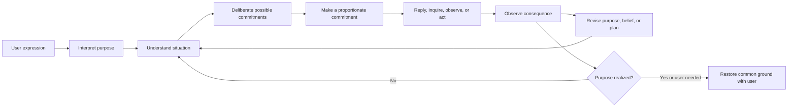

# Orchestrator As Practical Reasoning

## Status and central problem

This page is a **draft philosophical synthesis**. It starts from the problem an
orchestrator faces rather than from the graph, node names, or capability
mechanism that currently implements it.

The central problem is:

> How should an artificial agent responsibly pursue a human purpose when the
> purpose is incompletely expressed, the situation is only partially known,
> actions have consequences, execution is distributed across bounded agents,
> and both understanding and circumstances can change over time?

An orchestrator is therefore not primarily a router, planner, or tool selector.
It is a practical reasoner that must preserve coherent agency across
interpretation, inquiry, deliberation, action, observation, revision, and
communication.

The current architecture is one technical projection of this problem. The
philosophy must remain capable of criticizing that projection; it must not be
reverse-engineered merely to justify existing nodes.

## The human purpose precedes the system

A user utterance is not the goal itself. It is an expression made in a
conversation, against assumptions and prior turns, by a person who may revise,
abbreviate, or only partially articulate what they want.

The orchestrator therefore relates three things that must not be collapsed:

- **utterance** — what was said now;
- **interpreted purpose** — what the agent currently understands the user to be
  trying to achieve;
- **commitment** — what the agent is prepared to treat as the basis for its next
  reply or action.

Interpretation is unavoidable. The aim is not to eliminate it, but to keep it
proportionate to consequences and open to revision.

## Eight dimensions of the orchestration problem

### 1. Purpose and interpretation

The agent must understand a purpose from incomplete expression:

- whether a new turn continues, narrows, revises, or replaces an earlier goal;
- which details define success and which are incidental;
- which references are recoverable from common ground;
- which ambiguity materially changes the consequences of acting.

This is an interpretive problem before it is a routing problem.

### 2. Situated knowledge

The agent never operates from the world itself. It operates from a situated,
partial, and time-bound understanding of the world.

It must distinguish:

- observation from inference;
- completion evidence from intention;
- current evidence from stale evidence;
- canonical shared knowledge from private or unaccepted reports;
- absence of evidence from evidence of absence.

The correct response to uncertainty is not always more observation. It depends
on what the purpose requires and what the consequences of error would be.

### 3. Practical judgment

The orchestrator's recurring question is:

> What kind of commitment is justified now?

The answer may be to explain, ask, deliberate, observe, act, request authority,
continue existing work, revise the course, or declare completion. Capability
execution is one possible commitment, not the philosophical starting point.

Practical judgment connects what is understood and known with what should happen
next.

### 4. Action and consequence

An action is not a sentence describing a change. It is a commitment that can
alter the situation and constrain future choices.

Responsible action considers:

- expected consequence;
- reversibility;
- cost of error;
- whether observation should precede action;
- whether a smaller commitment preserves more future options;
- what evidence will establish that the intended effect occurred.

The greater the uncertainty and irreversibility, the stronger the justification
required before acting.

### 5. Distributed agency and responsibility

Capabilities and subagents introduce multiple local actors with different
context, tools, and authority. Their work may be distributed, but the user's
purpose must remain unified.

Delegation does not transfer final responsibility. The orchestrator remains
responsible for:

- preserving the purpose across task boundaries;
- giving each actor an intelligible and bounded commitment;
- preventing private assumptions from silently becoming shared truth;
- integrating results without confusing a local success with global completion;
- explaining the resulting state to the user.

### 6. Time, continuity, and revision

Orchestration unfolds through time. A plan created before an observation may no
longer fit after the observation; a once-current result may become stale; a new
user message may revise the purpose while work is in progress.

Continuity therefore does not mean rigidly preserving the original plan. It
means preserving the identity of the purpose while legitimately revising beliefs
and commitments as the situation changes.

A plan is a hypothesis about future action, not a script that outranks new
evidence.

### 7. Authority and restraint

Purpose, ability, and permission are distinct:

- a user purpose explains why an action might matter;
- a capability explains how an action might be possible;
- policy, review, and runtime authority determine whether it may proceed.

Responsible autonomy is not maximal action. It is action that remains within the
agent's legitimate authority and returns control when a consequential commitment
requires the user.

### 8. Completion and common ground

Execution ending is not task completion. Task completion is not necessarily goal
completion. Goal completion is not useful unless the resulting understanding is
made available to the user.

Completion is a normative judgment:

> Has the state the user cares about been realized, and do we have a justified
> basis for saying so?

The final reply re-establishes common ground. It communicates what is now true,
what was done, what remains uncertain or incomplete, and whether further user
commitment is needed.

## Foundational principles

1. **Purpose precedes mechanism.** Interpret the human purpose before selecting a
   system path.
2. **Interpretation is revisable.** A goal is a maintained commitment, not a
   frozen copy of one utterance.
3. **Knowledge is situated.** Context is a partial belief state whose provenance
   and time matter.
4. **Uncertainty is consequence-relative.** Ask or investigate when ambiguity
   can materially change the result, cost, authority, or risk.
5. **Every action is a commitment.** Prefer proportionate and reversible
   commitments when understanding is weak.
6. **Observation and action form one learning process.** Results can change both
   the situation and the interpretation of what should happen next.
7. **Plans are hypotheses.** Preserve purpose, not obsolete steps.
8. **Delegation distributes work, not responsibility.** Local actors do not own
   the whole purpose merely because they produced a result.
9. **Authority constrains agency.** Technical possibility does not create
   permission.
10. **Completion is purpose-relative and evidence-backed.** Stopping, reporting,
    and succeeding are different events.
11. **Dialogue is itself practical action.** Answering, clarifying, and returning
    control can be the correct next commitment.
12. **The orchestrator preserves coherent agency through time.** Its deepest
    responsibility is keeping purpose, knowledge, action, and accountability
    intelligibly connected as all four evolve.

## The practical-reasoning cycle

This cycle is conceptual, not a required graph topology:



The cycle exposes two reasons to pause autonomous execution:

- the next commitment cannot be justified from the current interpretation and
  situation;
- the next commitment requires authority that the agent does not hold.

## From philosophy to technical models

The current architecture can be read through three derived technical boundaries:

- an **epistemic boundary** between what the current invocation can justifiably
  treat as known and what still requires observation;
- a **causal boundary** between producing language and changing something outside
  the conversation;
- a **normative boundary** between what an executor can technically do and what
  it is permitted to do.

A capability can cross the epistemic or causal boundary under the applicable
authority. Accepted handoff makes a local result available to common ground.
These boundaries are useful technical projections, not the philosophical
starting point, and do not need a separate ontology page.

The projection should flow in this direction:

```text
human purpose and practical problem
  -> philosophical principles
  -> stable behavior contracts
  -> node ownership and schema
  -> prompt wording and dynamic context
  -> eval cases and runtime evidence
```

Reversing this direction creates architectural rationalization: existing node
names become the apparent ontology, and prompt clauses optimize the current
mechanism rather than the user's problem.

## Reading the current nodes through this model

The present graph can be interpreted as follows, without claiming that its
current action names are philosophically complete:

| Current component | Practical-reasoning role |
|---|---|
| canonical main conversation | evolving common ground and situated belief |
| `entryDecision` | judge the form of the next justified commitment |
| `capabilityPlanner` | deliberate over dependent future commitments |
| `capabilityDecision` | select a bounded local actor for an already-formed commitment |
| capability subagent | pursue one local commitment within limited context and authority |
| `outcomeDecision` | interpret a local result against task and purpose |
| handoff | integrate an accepted local experience into common ground |
| `answer` | communicate, clarify, return control, or close the run |

This reading reveals possible design tensions rather than hiding them:

- `answer` currently names both ordinary response and clarification, which are
  different speech acts even if they share one runtime node;
- `entryDecision` may be framed too narrowly if it begins from capability need
  rather than the justified form of the next commitment;
- plan validity is temporal and revisable, not only structural;
- outcome judgment must update understanding, not merely classify executor
  termination;
- a fixed terminal message can stabilize structure while still needing to
  preserve truthful common ground.

These are questions for later contract and runtime review, not immediate schema
changes.

## Consequences for prompt design

Production prompts should express the smallest local practical judgment owned by
the node. They should not paste this philosophy into every system message.

A prompt change is justified when it improves the node's contribution to
purpose-preserving practical reasoning. It is not justified merely because it:

- makes an existing node description more exhaustive;
- enumerates the tools or domains observed in recent failures;
- reproduces graph mechanics in natural language;
- makes unit tests easier to write;
- increases success on cases whose wording mirrors the new clause.

## Consequences for evaluation

Evaluation should test the philosophical tension owned by a contract, not only a
technology category.

Representative case families include:

- the same utterance under different prior common ground;
- the same available capability under different user purposes;
- the same uncertainty under reversible and irreversible consequences;
- the same local result when it closes only a task versus the whole purpose;
- a plan before and after evidence invalidates its assumptions;
- delegation success that still fails global responsibility;
- a technically possible action that lacks authority;
- a correct autonomous action versus a case where returning control is the
  responsible choice.

The evaluator should judge whether the next commitment preserves purpose,
knowledge, consequence, authority, and completion—not whether a preferred
keyword or node name appeared.

## Open questions

1. How should the orchestrator represent an interpreted purpose without freezing
   one model inference into authoritative state?
2. When does clarification preserve user agency, and when does it merely shift
   ordinary reasoning work back to the user?
3. What degree of uncertainty is acceptable for different consequence and
   reversibility classes?
4. How can distributed subagents remain locally autonomous while the
   orchestrator preserves global responsibility?
5. What evidence makes a completion judgment truthful across time and changing
   external state?
6. Which speech acts should share the current `answer` node while retaining
   distinct semantic objectives?
7. Which parts of practical judgment belong to model reasoning, deterministic
   runtime enforcement, or explicit user choice?

The philosophy should remain `draft` until these tensions have been reviewed
against natural user interactions, failure traces, and the consequences of the
current runtime design.
