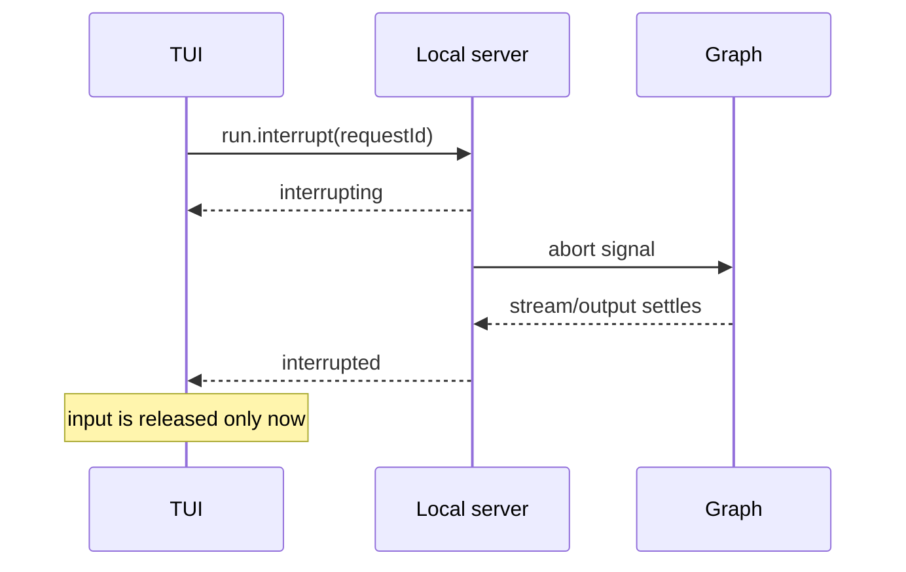
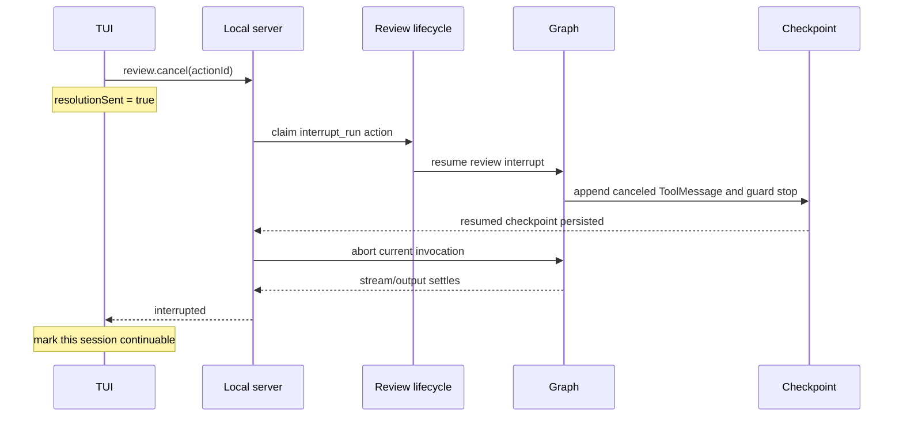
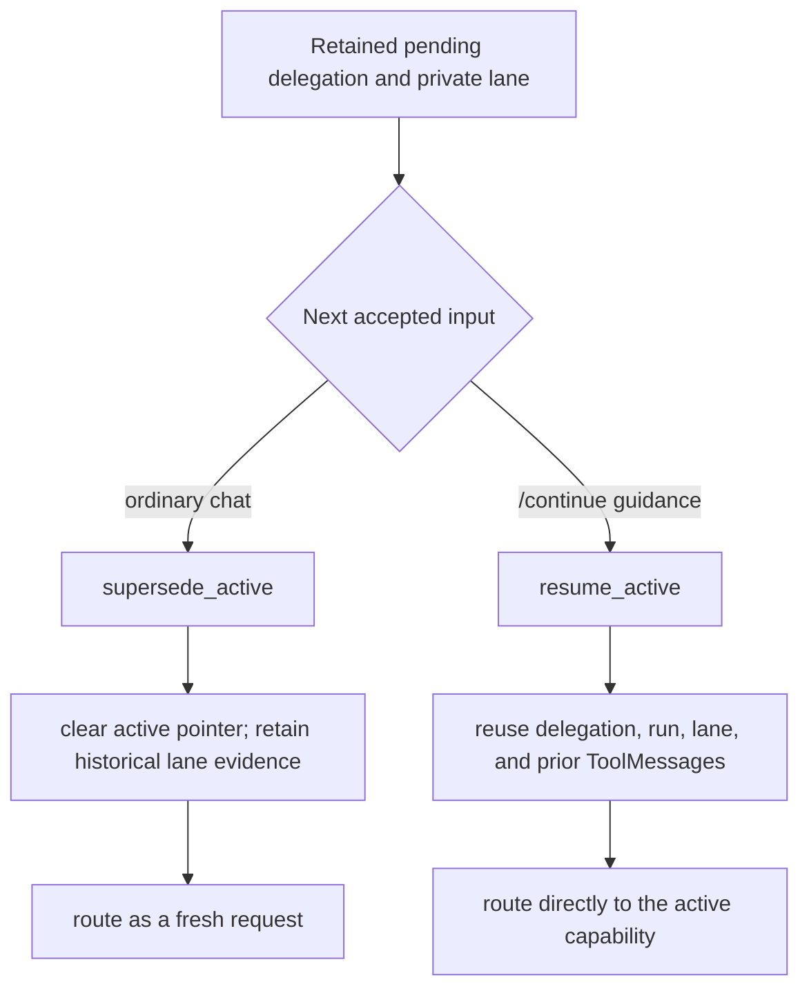

# Interruption And Delegation Continuation

## Scope

This page records the current end-to-end contract for stopping a local-agent run,
stopping specifically from `waiting_review`, retaining an unfinished delegation,
and choosing what the next user input means.

**Decision (PRs #468, #475, #481, and #485).** An interrupted invocation and
an unfinished delegation are different lifecycles:

- the local server owns whether the current invocation has actually stopped;
- the checkpoint owns whether an unfinished delegation can still be resumed;
- the next accepted chat request explicitly chooses whether to supersede or
  resume that delegation;
- the TUI exposes `/continue <指导>` only when it observed the narrow causal
  sequence that makes that command safe and understandable.

The implementation deliberately does not infer completion, cancellation, or
continuation from message prose.

## The facts that must stay separate

| Fact | Meaning | Owner |
| --- | --- | --- |
| interrupt intent | a client asked the current invocation to stop | client command |
| `interrupting` | the server accepted the stop request and signaled its abort controller | server-observed session projection |
| terminal `interrupted` | the invocation owner observed graph output settlement and terminalized the request | local server invocation owner |
| pending `ReviewAction` | the checkpoint is waiting for a review response | LangGraph checkpoint |
| review resolution progress | the TUI has sent one response/cancel command and must not send another | TUI-local `ReviewDraft.resolutionSent` |
| active delegation | the checkpoint identifies an unfinished delegation and its private lane | orchestrator state |
| continuation availability | this TUI instance canceled a review and later observed that invocation end as `interrupted` | TUI-local session marker |
| `resume_active` / `supersede_active` | how the next accepted request treats the active delegation | request protocol + orchestrator transition |

**Decision.** None of these facts substitutes for another. In particular:

- sending an interrupt is not proof that the graph has stopped;
- an interrupted invocation does not mean its delegation completed;
- canceling a review is not the same as selecting a review reject option;
- retaining a lane is not the same as advertising `/continue` in every client;
- restoring a session with `/resume` is not continuing an active delegation with
  `/continue`.

## End-to-end state model

The normal interruption path terminalizes the invocation but makes no special
continuation promise:

The `waiting_review` Esc path has an additional checkpoint boundary:

After that authoritative terminal event, the next accepted input chooses one of
two paths:

## Regular run interruption

**Fact (issue #465 / PR #468).**
[`InflightRequestController`](../../services/local-agent/src/inflightRequestController.ts)
matches `run.interrupt` to the exact inflight `requestId`, emits
`interrupting`, and aborts the request's controller. It deliberately retains
inflight ownership while the graph is settling.

**Decision.** Only the invocation owner may emit terminal `interrupted` and clear
the inflight request. The client and the interrupt handler cannot know that the
graph has stopped merely because an abort signal was sent.

[`chatSessionAdapter.ts`](../../services/local-agent/src/chatSessionAdapter.ts)
therefore waits for `GraphRunStream.output` to settle before running the
interrupted terminal callback. This closes the cancellation race where buffered
events or delayed output could outlive an already-reported terminal state.

[`ThreadInvocationCoordinator`](../../services/local-agent/src/threadInvocationCoordinator.ts)
also serializes invocations for the same graph thread. A replacement can signal
its predecessor, but it enters the graph only after that predecessor settles.
Different graph threads remain independent.

**Consequence.** There is no local or server timeout that fabricates a terminal
state. The TUI can display a “still stopping” notice after ten seconds, but the
notice neither emits `run.finish` nor releases input. This preserves the
distinction between informing the user and claiming that the run ended.

**Fact.** Disconnect cleanup signals all affected inflight requests but does not
clear their ownership synchronously. Until each owner settles and clears its own
request, global active-request guards can still reject a session resume. This is
an intentional, usually brief safety window rather than proof of a wedged
session.

## Esc while `waiting_review`

### Cancel is a control action, not a review verdict

**Fact.** When the focused run is in `waiting_review` and that review has not
already been resolved, Esc sends `review.cancel`. The server maps that command to
the internal `{ action: 'interrupt_run' }` control action. It does not choose a
declared reject option and therefore works even when the review schema has no
reject option.

This changes the old meaning of Esc. It no longer means “reject this tool call
and let the subagent continue reasoning.” It means “consume this review
interrupt, stop this invocation at a persisted boundary, and retain the
unfinished delegation for an explicit later decision.”

### The safe checkpoint boundary

**Fact.** The review middleware handles `interrupt_run` by:

1. appending a canceled `ToolMessage` whose provenance source is
   `human_interrupt`;
2. appending a `human_review_run_interrupted` guard-stop marker;
3. jumping to the end of the subagent run without another child-model call;
4. producing no announce and no accepted handoff.

The local server queues the run interrupt before resuming the graph, but applies
the abort only after the resumed review checkpoint has been persisted. The
`actionId`-keyed
[`ReviewResolutionLifecycle`](../../services/local-agent/src/reviewResolutionLifecycle.ts)
owns route, claim, consumption, and this interrupt ordering.

**Decision.** The server interrupts only if the original review was consumed and
the resumed checkpoint did not immediately expose a newer pending review. This
prevents a late cancel from aborting a different review action belonging to the
same run.

### State retained after the stop

**Fact.** The capability node maps this guard stop to
`completionReason: 'interrupted'` with no announce. It skips normal delegation
finalization, retains `taskActiveDelegation` as pending, retains the exact private
lane and artifacts, and routes the graph to `END`.

That retained lane includes the delegation briefing, prior subagent messages,
the canceled tool result, and the guard-stop evidence. A later explicit resume
therefore sees why execution stopped and does not have to reconstruct the task
from a fresh prompt.

**Decision.** No handoff is created for interrupted or otherwise incomplete
work. A handoff means an announced result was accepted into the main
conversation; interruption establishes neither announcement nor acceptance.
Only a completed outcome can finalize the delegation and clear its lane.

PR #481 applies the same retention boundary to `user_input_required`: incomplete
delegations remain resumable, while only accepted completed outcomes cross the
handoff boundary.

## Meaning of the next request

`ChatRequestMessage.activeDelegationTransition` carries the explicit transition.
The orchestrator applies it before normal entry routing.

| Next request | Transition | Result |
| --- | --- | --- |
| ordinary chat input | default `supersede_active` | detach the active pointer and process a fresh request |
| `/continue <指导>` | `resume_active` | reuse the pending delegation and route directly to its capability |
| API request with `resume_active` and an awaiting-decision delegation | `resume_active` | route to outcome decision |
| `resume_active` with no active delegation | no graph transition | caller has violated the continuation precondition |

### Supersede

**Decision (PR #475).** Superseding clears only the active-delegation pointer. It
does not delete the old private-lane messages or fabricate a handoff. Those
messages remain checkpoint evidence but are excluded from canonical main context,
so the fresh request cannot be polluted by unfinished review state.

### Resume

**Fact.** Resuming materializes the same lane, run ID, delegation ID, prior
messages, and tool results. The guidance summary/gap note is clipped to 2,000
characters before it is projected into the continuation briefing. A pending
delegation routes directly back to the selected capability; an
awaiting-decision delegation routes to outcome handling.

When the resumed delegation later completes, normal announce, outcome, and
handoff rules apply. Completion — not the earlier interruption — is what clears
the lane.

## TUI `/continue` affordance

**Decision (PR #485).** The TUI does not expose `/continue` merely because it has
seen any interrupted run. It records a session as continuable only when all of
the following are true:

1. this TUI instance sent `review.cancel` for a specific request/session;
2. the server later terminalized that same request as `interrupted`;
3. no competing terminal outcome invalidated that causal chain.

Only then does the command palette show `/continue <指导>`. The command requires
guidance, sends `resume_active`, and consumes the local availability marker only
after the transport accepts the request. A send failure retains the marker for a
retry. An ordinary accepted chat request consumes the marker because it
supersedes the delegation.

**Decision.** A normal `run.interrupt` does not enable `/continue`. The server may
retain checkpoint data for several kinds of incomplete work, but the TUI only
advertises a continuation whose origin and user meaning it knows.

**Boundary.** Continuation availability is process-local UI causality, not part
of `AgentSessionSnapshot` or the wire protocol. Restarting the TUI loses the
affordance even if the durable checkpoint still contains a pending delegation.
The graph API can accept `resume_active`, but API callers must establish its
precondition themselves. See the corresponding
[open question](questions/session-projection-open-questions.md#5-reconstructing-continuation-availability-after-a-client-restart).

## Failure and edge-case behavior

| Situation | Current behavior | Reason |
| --- | --- | --- |
| interrupt signal sent, graph output still pending | remain busy/interrupting | terminal truth belongs to the invocation owner |
| stop takes longer than ten seconds | show a notice, keep input gated | user feedback must not fabricate completion |
| WebSocket disconnect during settlement | abort affected runs; owner clears later | preserve single-owner terminalization |
| Esc after review resolution was already sent | do not cancel the same review again | `resolutionSent` is the local one-shot gate |
| canceled review resumes into a newer review | do not apply the queued abort to the new review | checkpoint identity protects the newer action |
| ordinary input after review interruption | fresh request; old active pointer superseded | new user intent must not inherit review state |
| `/continue` transport send fails | keep command availability | no transition was accepted |
| `/continue` issued through the API without an active delegation | no active transition; normal entry processing remains possible | protocol callers own this precondition |
| TUI restarts before continuation | no `/continue` affordance reconstructed | marker is intentionally not a snapshot fact today |

## Invariants for future changes

1. **Terminal ownership:** only the invocation owner reports `interrupted`, after
   graph output settles.
2. **No fabricated recovery:** timers may explain delay but may not release the
   run or emit a terminal event.
3. **Review identity:** cancel/resume ordering stays keyed by `actionId`; a stale
   cancel cannot target a newer review.
4. **Persist before abort:** review cancellation reaches a checkpoint that
   records the canceled tool result and guard stop before the invocation is
   aborted.
5. **No work after Esc:** the review-canceled subagent performs no further model
   call, announce, or handoff in that invocation.
6. **Incomplete means retained:** interrupted and user-input-required
   delegations retain their active state and private lane.
7. **Completed means accepted:** only normal completion and accepted handoff
   clear the delegation lane.
8. **Fresh and continued turns are explicit:** ordinary input supersedes;
   `resume_active` continues.
9. **Provenance stays structural:** lane, delegation, run, message, tool, guard,
   and handoff metadata carry meaning; prose does not.
10. **UI affordance is narrower than runtime capability:** the TUI advertises
    only continuation states it can explain, even though the graph can retain
    other resumable states.

## Evidence and evolution

- [Issue #465](https://github.com/pinpawo/pinpawo-agent/issues/465) and
  [PR #468](https://github.com/pinpawo/pinpawo-agent/pull/468) established graph
  output settlement and same-thread serialization as the terminal ownership
  boundary.
- [Issue #466](https://github.com/pinpawo/pinpawo-agent/issues/466) defined the
  fresh-turn pollution problem and the explicit supersede/resume contract.
- [Issue #478](https://github.com/pinpawo/pinpawo-agent/issues/478) defined Esc
  from `waiting_review` as suspension at a resumable checkpoint rather than a
  review rejection.
- [PR #475](https://github.com/pinpawo/pinpawo-agent/pull/475) separated fresh
  turns from interrupted delegations, added explicit supersede/resume
  transitions, and made waiting-review Esc stop at a resumable checkpoint.
- [PR #481](https://github.com/pinpawo/pinpawo-agent/pull/481) generalized lane
  retention to incomplete delegation outcomes and reserved handoff/cleanup for
  accepted completion.
- [PR #485](https://github.com/pinpawo/pinpawo-agent/pull/485) added the
  causally-gated TUI `/continue` flow.

The authoritative regression coverage is in
[`orchestrator.test.ts`](../../packages/pet-agent/src/agent/orchestrator/orchestrator.test.ts),
[`localServerChatHandler.test.ts`](../../services/local-agent/src/localServerChatHandler.test.ts),
[`chatSessionAdapter.test.ts`](../../services/local-agent/src/chatSessionAdapter.test.ts),
and
[`tuiRuntimeController.test.ts`](../../services/local-agent/src/tuiRuntimeController.test.ts).

**Source note.** The older source contract
[`LOCAL_AGENT_SESSION_PROJECTION.md`](../LOCAL_AGENT_SESSION_PROJECTION.md) uses
type and implementation terminology that predates both the shared
`@pinpawo/agent-session` package and the current `ReviewResolutionLifecycle`.
For current behavior, the merged implementation and tests listed in this page's
frontmatter take precedence.
