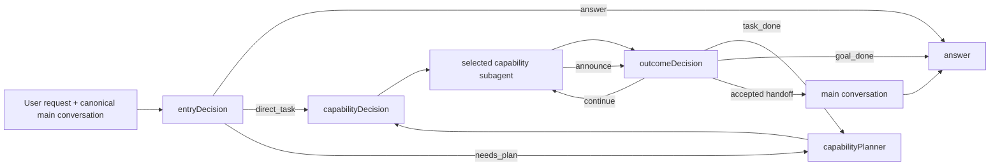

# System Prompt Design Knowledge Map

## Current synthesis

The orchestrator prompt system is not one prompt. It is a set of contracts that
sit on top of a deterministic graph and a provenance-aware message model.



Five relationships organize the current knowledge:

1. [Prompt knowledge layers](concepts/prompt-knowledge-layers.md) distinguish
   stable contracts, conditional provider protocol, injected facts, and code
   enforcement.
2. [System prompt authoring principles](concepts/system-prompt-authoring-principles.md)
   define positive-first behavior contracts, the valid scope of negative
   constraints, and when enforcement belongs to the harness.
3. [Decision node ownership](concepts/decision-node-ownership.md) keeps semantic
   judgments vertical: entry shape, plan boundary, executor choice, and outcome
   acceptance have different owners.
4. [Message context and provenance](concepts/message-context-and-provenance.md)
   determines which messages each actor sees and how briefing, announce, and
   handoff identities are established.
5. [The answer close](decisions/delegation-completion-acknowledgement.md) provides
   a fixed post-delegation message shape rather than repeating the deliverable.

## Prompt Contract Map

This table is the traceability map. One row represents one stable behavior
contract, not one sentence in a prompt. The map intentionally has only five
relations: contract, owner, design source, implementation, and verification.

| Contract | Owner | Design source | Implementation | Verification |
|---|---|---|---|---|
| `decision.structured-judgment` — decision nodes return their owned structured judgment; the graph advances execution and state, and `answer` produces the user-visible reply | [shared decision infrastructure](concepts/prompt-knowledge-layers.md) | [Prompt knowledge layers](concepts/prompt-knowledge-layers.md), [decision prompt design](../PET_AGENT_DECISION_SYSTEM_PROMPT_DESIGN.md) | [`sharedPrefix.prompt.ts`](../../packages/pet-agent/src/agent/orchestrator/prompts/templates/sharedPrefix.prompt.ts), [`schemas.ts`](../../packages/pet-agent/src/agent/orchestrator/schemas.ts), [`orchestrationDecision.ts`](../../packages/pet-agent/src/agent/orchestrator/runtime/decisions/orchestrationDecision.ts) | [`prompts.test.ts`](../../packages/pet-agent/src/agent/orchestrator/prompts.test.ts), [`schemas.test.ts`](../../packages/pet-agent/src/agent/orchestrator/schemas.test.ts) |
| `entry.execution-shape` — choose `answer`, one execution boundary, or multiple execution boundaries from the available evidence | [`entryDecision`](concepts/decision-node-ownership.md#vertical-decisions) | [State-query investigation](investigations/entry-decision-state-query-routing.md), [#416](https://github.com/pinpawo/pinpawo-agent/issues/416) | [`entryDecision.prompt.ts`](../../packages/pet-agent/src/agent/orchestrator/prompts/templates/entryDecision.prompt.ts), [`schemas.ts`](../../packages/pet-agent/src/agent/orchestrator/schemas.ts) | [`entry-decision-basics.ts`](../../packages/pet-agent/evals/datasets/entry-decision-basics.ts), [`orchestrator-route.eval.ts`](../../packages/pet-agent/evals/orchestrator-route.eval.ts) |
| `planner.execution-boundary` — materialize one independently executable current task and retain only the future tail | [`capabilityPlanner`](concepts/decision-node-ownership.md#vertical-decisions) | [Decision node ownership](concepts/decision-node-ownership.md), [decision prompt design](../PET_AGENT_DECISION_SYSTEM_PROMPT_DESIGN.md) | [`capabilityPlanner.prompt.ts`](../../packages/pet-agent/src/agent/orchestrator/prompts/templates/capabilityPlanner.prompt.ts), [`schemas.ts`](../../packages/pet-agent/src/agent/orchestrator/schemas.ts) | [`capability-planning-basics.ts`](../../packages/pet-agent/evals/datasets/capability-planning-basics.ts) |
| `capability.executor-selection` — select one available executor for the immutable current task | [`capabilityDecision`](concepts/decision-node-ownership.md#vertical-decisions) | [Decision node ownership](concepts/decision-node-ownership.md), [decision prompt design](../PET_AGENT_DECISION_SYSTEM_PROMPT_DESIGN.md) | [`capabilityDecision.prompt.ts`](../../packages/pet-agent/src/agent/orchestrator/prompts/templates/capabilityDecision.prompt.ts), [`schemas.ts`](../../packages/pet-agent/src/agent/orchestrator/schemas.ts) | [`capability-decision-basics.ts`](../../packages/pet-agent/evals/datasets/capability-decision-basics.ts) |
| `outcome.announce-verdict` — validate the current announce as continue, current-task completion, or user-goal completion | [`outcomeDecision`](concepts/decision-node-ownership.md#vertical-decisions) | [Decision node ownership](concepts/decision-node-ownership.md), [message context and provenance](concepts/message-context-and-provenance.md) | [`outcomeDecision.prompt.ts`](../../packages/pet-agent/src/agent/orchestrator/prompts/templates/outcomeDecision.prompt.ts), [`schemas.ts`](../../packages/pet-agent/src/agent/orchestrator/schemas.ts) | [`outcome-decision-basics.ts`](../../packages/pet-agent/evals/datasets/outcome-decision-basics.ts), [`orchestrator-flow.mock-subagent.eval.ts`](../../packages/pet-agent/evals/orchestrator-flow.mock-subagent.eval.ts) |
| `answer.user-visible-close` — produce the user-visible response and preserve the fixed post-delegation acknowledgement shape | [`answer`](concepts/decision-node-ownership.md#vertical-decisions) | [Delegation completion acknowledgement](decisions/delegation-completion-acknowledgement.md), [message context and provenance](concepts/message-context-and-provenance.md) | [`answer.prompt.ts`](../../packages/pet-agent/src/agent/orchestrator/prompts/templates/answer.prompt.ts), [`answer.ts`](../../packages/pet-agent/src/agent/orchestrator/runtime/nodes/answer.ts) | [`answer-behavior-basics.ts`](../../packages/pet-agent/evals/datasets/answer-behavior-basics.ts), [`answer-eval-scenarios.ts`](../../packages/pet-agent/evals/answer-eval-scenarios.ts), [`orchestrator.test.ts`](../../packages/pet-agent/src/agent/orchestrator/orchestrator.test.ts) |

Maintenance stays deliberately small:

- add or split a row only when a stable behavior contract gains a distinct owner;
- update a row when its meaning, owner, design source, implementation, or
  verification changes;
- do not inventory individual prompt sentences, model-specific tuning notes, or
  historical clause versions here; those remain in prompt files, source pages,
  issues, evals, and Git history.

### Verification derives from the contract

The contract in each row is also the source of truth for its eval objective.
Verification does not begin from a reusable metric list. It instantiates the
owned behavior in a concrete case:

```text
stable behavior contract
  -> case objective
  -> acceptance criteria
  -> goal-achieved judgment
  -> error classification and run diagnostics
```

Only the objective and its acceptance criteria determine semantic success.
Schema validity, invocation status, token use, latency, cost, output length, and
similar measurements remain separate run evidence unless the stable contract
explicitly makes one of them part of success. The detailed application to each
current prompt lives in
[System Prompt Authoring Principles](concepts/system-prompt-authoring-principles.md#evaluation-targets-derived-from-prompt-contracts).

## Evolution, not replacement

The present architecture accumulated through several deliberate steps:

- #345 separated static prompt contracts from dynamic facts.
- #349–#352 introduced capability-aware planning and vertically owned decisions.
- #338 established the completion acknowledgement at the answer boundary.
- #363/#366 separated downward delegation briefing from upward handoff.
- #370 removed global recent-announce recall and preserved canonical message order.
- #398/#404 made metadata and message IDs the only protocol identity signals.

New work should state which of these accepted decisions it extends, revises, or
supersedes. An isolated prompt edit is not enough when it changes the meaning of
an action or message role.

## Current investigation

The [entryDecision state-query investigation](investigations/entry-decision-state-query-routing.md)
found a semantic gap introduced during the planner prompt refactor: the older
taskDecision contract explicitly classified reading, searching, running, and
external access as execution, while the migrated entry prompt broadly classified
questions about recent status as `answer`. The #416 implementation candidate now
defines the boundary through sufficient existing evidence versus one or multiple
new execution results. This remains a migration regression under evaluation, not
a reason to redesign unrelated answer, handoff, or provenance mechanisms.

The accepted follow-up structure is tracked by
[issue #418](https://github.com/pinpawo/pinpawo-agent/issues/418):

- [#416](https://github.com/pinpawo/pinpawo-agent/issues/416) owns the narrow,
  domain-independent evidence/execution semantic correction;
- [#417](https://github.com/pinpawo/pinpawo-agent/issues/417) owns the incremental
  positive-first prompt refactor;
- [#415](https://github.com/pinpawo/pinpawo-agent/issues/415) owns the Prompt
  Contract Map and maintenance workflow.

## Knowledge health

The source set is unusually strong on historical design, but weaker on:

- real-model validation of the candidate “new execution result” definition at
  run entry;
- complete verification coverage for each stable behavior contract in the map;
- page-level freshness/dependency checks when implementation changes;
- a consistent status distinction among current, pinned, draft, superseded, and
  historical top-level documents.

These gaps drive the [open questions](questions/system-prompts-open-questions.md)
and [docs migration plan](migrations/docs-wiki-management-plan.md).
