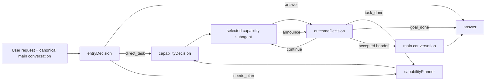

# System Prompt Design Knowledge Map

## Current synthesis

The orchestrator prompt system is not one prompt. It is a set of contracts that
sit on top of a deterministic graph and a provenance-aware message model.

Four relationships organize the current knowledge:

1. [Prompt knowledge layers](concepts/prompt-knowledge-layers.md) distinguish
   stable contracts, conditional provider protocol, injected facts, and code
   enforcement.
2. [Decision node ownership](concepts/decision-node-ownership.md) keeps semantic
   judgments vertical: entry shape, plan boundary, executor choice, and outcome
   acceptance have different owners.
3. [Message context and provenance](concepts/message-context-and-provenance.md)
   determines which messages each actor sees and how briefing, announce, and
   handoff identities are established.
4. [The answer close](decisions/delegation-completion-acknowledgement.md) provides
   a fixed post-delegation message shape rather than repeating the deliverable.

## Evolution, not replacement

The present architecture accumulated through several deliberate steps:

- #345 separated static prompt contracts from dynamic facts.
- #349–#352 introduced capability-aware planning and vertically owned decisions.
- #338 established the completion acknowledgement at the answer boundary.
- #363/#366 separated downward delegation briefing from upward handoff.
- #370 removed global recent-announce recall and preserved canonical message order.
- #398/#404 made metadata and message IDs the only protocol identity signals.

New work should state which of these accepted decisions it extends, revises, or
supersedes. An isolated prompt edit is not enough when it changes the meaning of
an action or message role.

## Current investigation

The [entryDecision state-query investigation](investigations/entry-decision-state-query-routing.md)
found a semantic gap introduced during the planner prompt refactor: the older
taskDecision contract explicitly classified reading, searching, running, and
external access as execution, while the current entry prompt broadly classifies
questions about recent status as `answer`. This is recorded as a migration
regression, not a reason to redesign unrelated answer, handoff, or provenance
mechanisms.

## Knowledge health

The source set is unusually strong on historical design, but weaker on:

- a canonical definition of “new execution result” at run entry;
- an explicit traceability map from each production prompt clause to a design
  decision and eval;
- page-level freshness/dependency checks when implementation changes;
- a consistent status distinction among current, pinned, draft, superseded, and
  historical top-level documents.

These gaps drive the [open questions](questions/system-prompts-open-questions.md)
and [docs migration plan](migrations/docs-wiki-management-plan.md).
