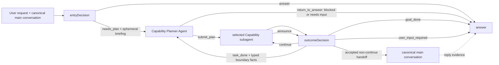

# System Prompt Design Knowledge Map

## Current synthesis

The orchestrator is a task loop over four semantic owners. Code supplies typed
state, limits, routing, and a filesystem map of compiled Capabilities; models
own the judgments that require interpretation.

The current architecture has these relationships:

1. [Practical reasoning](concepts/orchestrator-practical-reasoning.md) begins
   with the user purpose, incomplete knowledge, consequential action, returned
   results, and revision over time.
2. [Prompt knowledge layers](concepts/prompt-knowledge-layers.md) separate
   stable contracts, provider protocol, invocation facts, and deterministic
   enforcement.
3. [Decision ownership](concepts/decision-node-ownership.md) keeps result
   availability, planning and Capability choice, outcome acceptance, and
   user-visible communication with the actors that have the needed evidence.
4. [Capability Planner task boundaries](decisions/capability-planner-task-boundaries.md)
   define a private tool-loop agent that explores the Capability Document
   Workspace, forms the current task, chooses its Capability, and maintains the
   unstarted future tail.
5. [Capability / Toolkit V2](capability-toolkit-architecture.md) defines the
   executor inventory below the Planner: Capability owns delegatable business
   intent, Toolkit owns coded action, and `uses` is the compiled permission
   boundary.
6. [Message provenance](concepts/message-context-and-provenance.md) determines
   which messages each actor sees and how briefing, announce, and handoff
   identities are established.
7. [Terminal outcome semantics](decisions/delegation-completion-acknowledgement.md)
   keep task completion, user-goal completion, required user input, and the
   answer close distinct.
8. [Dynamic context governance](concepts/dynamic-context-governance.md) proposes
   one ownership path from runtime projection through typed facts and prompt
   package assembly. Entry and Planner dispatches now follow part of this
   contract; repository-wide placement remains an active migration.

## Prompt Contract Map

One row represents one stable behavior contract.

| Contract | Owner | Design source | Implementation | Verification |
|---|---|---|---|---|
| `decision.structured-judgment` — a decision returns only its owned structured judgment; graph code advances state and `answer` produces the user-visible reply | shared decision infrastructure | [Prompt knowledge layers](concepts/prompt-knowledge-layers.md), [decision prompt design](../PET_AGENT_DECISION_SYSTEM_PROMPT_DESIGN.md) | [`sharedPrefix.prompt.ts`](../../packages/pet-agent/src/agent/orchestrator/prompts/templates/sharedPrefix.prompt.ts), [`schemas.ts`](../../packages/pet-agent/src/agent/orchestrator/schemas.ts) | [`prompts.test.ts`](../../packages/pet-agent/src/agent/orchestrator/prompts.test.ts), [`schemas.test.ts`](../../packages/pet-agent/src/agent/orchestrator/schemas.test.ts) |
| `entry.result-availability` — choose `answer` when canonical main context already supports the reply or clarification is required; choose `needs_plan` when the goal still requires a new result | [`entryDecision`](concepts/decision-node-ownership.md#vertical-decisions) | [Decision prompt design](../PET_AGENT_DECISION_SYSTEM_PROMPT_DESIGN.md) | [`entryDecision.prompt.ts`](../../packages/pet-agent/src/agent/orchestrator/prompts/templates/entryDecision.prompt.ts), [`orchestrationDecision.ts`](../../packages/pet-agent/src/agent/orchestrator/runtime/decisions/orchestrationDecision.ts) | [`entry-decision-basics.ts`](../../packages/pet-agent/evals/datasets/entry-decision-basics.ts), [`entry-decision.eval.ts`](../../packages/pet-agent/evals/entry-decision.eval.ts) |
| `planner.task-and-capability` — explore compiled Capability documents, submit an executable task sequence, or return bounded planning facts when execution cannot proceed | [Capability Planner Agent](concepts/decision-node-ownership.md#vertical-decisions) | [Planner task and selection decision](decisions/capability-planner-task-boundaries.md), [decision prompt design](../PET_AGENT_DECISION_SYSTEM_PROMPT_DESIGN.md) | [`capabilityPlannerAgent.prompt.ts`](../../packages/pet-agent/src/agent/orchestrator/prompts/templates/capabilityPlannerAgent.prompt.ts), [`agent.ts`](../../packages/pet-agent/src/agent/orchestrator/capabilityPlanner/agent.ts), [`capabilityPlanner.ts`](../../packages/pet-agent/src/agent/orchestrator/runtime/nodes/capabilityPlanner.ts) | [`agent.test.ts`](../../packages/pet-agent/src/agent/orchestrator/capabilityPlanner/agent.test.ts), [`capability-planning-basics.ts`](../../packages/pet-agent/evals/datasets/capability-planning-basics.ts), [`capability-planning-evaluation.ts`](../../packages/pet-agent/evals/capability-planning-evaluation.ts) |
| `outcome.announce-verdict` — classify the current announce as continued work, current-task completion with later autonomous work, user-goal completion, or a user-input boundary | [`outcomeDecision`](concepts/decision-node-ownership.md#vertical-decisions) | [Terminal semantics](../ORCHESTRATOR_TERMINAL_SEMANTICS_DRAFT.md), [message provenance](concepts/message-context-and-provenance.md) | [`outcomeDecision.prompt.ts`](../../packages/pet-agent/src/agent/orchestrator/prompts/templates/outcomeDecision.prompt.ts), [`schemas.ts`](../../packages/pet-agent/src/agent/orchestrator/schemas.ts) | [`outcome-decision-basics.ts`](../../packages/pet-agent/evals/datasets/outcome-decision-basics.ts), [`decision-eval-scenarios.ts`](../../packages/pet-agent/evals/decision-eval-scenarios.ts) |
| `answer.user-visible-close` — fulfil the current reply objective from canonical evidence, using fixed acknowledgement only for genuine goal completion | [`answer`](concepts/decision-node-ownership.md#vertical-decisions) | [Delegation completion acknowledgement](decisions/delegation-completion-acknowledgement.md), [terminal semantics](../ORCHESTRATOR_TERMINAL_SEMANTICS_DRAFT.md) | [`answer.prompt.ts`](../../packages/pet-agent/src/agent/orchestrator/prompts/templates/answer.prompt.ts), [`answer.ts`](../../packages/pet-agent/src/agent/orchestrator/runtime/nodes/answer.ts) | [`answer-behavior-basics.ts`](../../packages/pet-agent/evals/datasets/answer-behavior-basics.ts), [`answer-eval-scenarios.ts`](../../packages/pet-agent/evals/answer-eval-scenarios.ts) |

The map is an index, not a prompt clause inventory. Update a row only when its
meaning, owner, source, implementation, or verification changes.

## Current ownership consequences

- Every run that needs a new result enters the Planner; entry has no
  execution-side bypass.
- Planning and concrete Capability selection are one model-owned exploration
  problem rather than two separately interpreted stages.
- The Planner may return bounded planning facts to Answer when no executable
  plan can proceed or user input is required. This path does not decide that
  the user goal is complete; only `outcomeDecision: goal_done` owns that meaning.
- When no specialized Capability matches and compiled `general` can perform the
  task, the Planner reads its document and selects it.
- When no executable Capability exists, the Planner uses `return_to_answer`
  rather than fabricating a task. When `general` is available and can perform
  the task, it is selected through `submit_plan` like any other Capability.

These are accepted contracts from
[issue #490](https://github.com/pinpawo/pinpawo-agent/issues/490) and
[PR #492](https://github.com/pinpawo/pinpawo-agent/pull/492), not wording-only
prompt preferences.

## Evaluation ownership

- Entry evals judge result availability only.
- Planner evals judge document exploration, current task correctness, concrete
  Capability selection, justified boundaries, and future-goal preservation.
- Outcome evals judge the announce verdict, including the requirement that
  `task_done` still has autonomous follow-up work.
- Lifecycle evals verify graph composition, handoff, delegation count, terminal
  state, tokens, and latency.

Deterministic tests protect schema, tool protocol, workspace containment,
runtime invariants, and graph routes. They do not infer model behavior from
prompt text.

## Knowledge health

The current implementation and local deterministic suites are aligned. Remaining
evidence work is tracked in [open questions](questions/system-prompts-open-questions.md):

- cross-model behavior of filesystem-based Capability exploration;
- context and iteration budgets as the Capability registry grows;
- evidence sufficiency and freshness at run entry;
- automated Wiki source/link freshness checks;
- alignment between current dynamic-context placement and the governance
  contract described in [Dynamic Context Governance](concepts/dynamic-context-governance.md).
