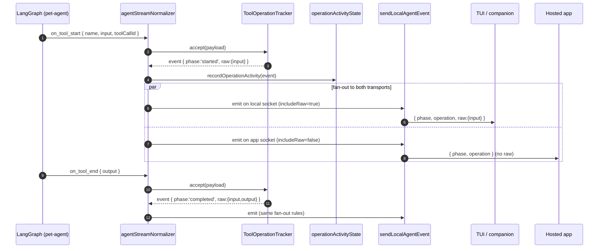

# Local-Agent Event Pipeline

This document describes how tool-call activity inside `pet-agent` becomes
`operation` events that reach a TUI, the macOS companion, or the hosted
PinPawo app — and where the `operation.raw` payload (raw tool input/output)
is allowed to cross the wire.

## Big picture

```mermaid
flowchart LR
  subgraph pet[pet-agent runtime]
    LG[LangGraph stream<br/>on_tool_start/end]
  end

  subgraph local[local-agent service]
    NORM[agentStreamNormalizer<br/>→ LocalAgentOperationEvent]
    TRK[ToolOperationTracker<br/>(id reuse, finishActive)]
    REG[recordOperationActivity<br/>operationActivityState]
    APPOUT[sendLocalAgentEvent<br/>(includeRaw=false)]
    LOCOUT[sendLocalAgentEvent<br/>(includeRaw=true)]
  end

  subgraph remote[Hosted PinPawo app]
    APPUI[Remote chat UI<br/>reads summary/details only]
  end

  subgraph trusted[Trusted local clients]
    TUI[Ink TUI<br/>tuiStateReducer]
    MAC[macOS companion]
  end

  LG --> NORM --> TRK --> REG
  REG --> APPOUT
  REG --> LOCOUT
  APPOUT -- "raw stripped" --> APPUI
  LOCOUT -- "raw preserved" --> TUI
  LOCOUT -- "raw preserved" --> MAC
```

Two physical egress points exist:

| Egress | File | Audience | `includeRaw` |
| --- | --- | --- | --- |
| App WS relay | `runtime.ts` (`inflightRequests`), `localAgentAppChatHandler.ts` | Hosted PinPawo app over public WSS | **false** (default) |
| Local HTTP/WS server | `localServer.ts`, `localServerChatHandler.ts`, `localServerStudioHandler.ts` | TUI / companion on `127.0.0.1:3210` | **true** |

Both call the same `sendLocalAgentEvent(ws, event, options?)`. The single
choice they make is whether to pass `includeRaw: true`.

## Why two modes

`operation.raw.input/output/error` is the unmodified tool-call payload.
Toolkit authors also provide `operations[toolName].summarize{Input,Output,Error}`,
which produce a structured `{ target, summary, details }` projection of the
same data — see `packages/pet-agent/src/types/toolkit.ts`.

These two channels serve different needs:

- `summary/target/details` — small, schema-stable, safe to render anywhere.
  This is the only thing toolkit authors guarantee.
- `raw` — the full tool input/output. Useful for UIs that want to do things
  the toolkit author didn't pre-imagine: diff renderers, "expand JSON",
  re-running the call locally, debugging. But it can be large and may contain
  sensitive content from the user's environment.

The hosted app talks to the local agent over a public relay, so we keep `raw`
off that wire. Local clients run on the same machine as the agent and already
have full filesystem/shell access — there's nothing to "leak" to them, and
they're the surface that most needs raw data for advanced rendering.

## Per-event lifecycle



When a turn ends mid-stream (user interrupt, error), the tracker's
`finishActive(phase, error)` synthesizes terminal events for any tool calls
that didn't naturally complete; they go through the same fan-out.

## Where `raw` is consumed locally

- `localServerOperationEvents.ts` — pretty-prints `raw.input/error` into the
  local-agent log (truncated). Lives inside the agent process; doesn't cross
  any wire.
- TUI / companion clients receive `event.operation.raw` through the local WS
  parser (`parseLocalAgentServerMessage`) and may use it for diff/inspection
  rendering. UIs that don't need raw can simply ignore it.

## Wire schema reference

```ts
type LocalAgentOperationEvent = {
  type: 'operation';
  requestId: string;
  phase: 'started' | 'updated' | 'completed' | 'failed' | 'interrupted';
  operation: {
    id?: string;
    kind: string;                 // e.g. 'bash.read_file', 'browser.click'
    title?: string;               // human-readable, supplied by toolkit author
    target?: string;              // e.g. file path / URL
    summary?: string;             // short status, e.g. '已完成'
    details?: Record<string, unknown>; // toolkit-defined structured data
    source?: {
      provider: 'toolkit' | 'toolset' | 'runtime';
      name: string;
      toolName?: string;
      callId?: string;
    };
  };
  // Only present on transports that opted into `includeRaw: true`.
  raw?: {
    input?: unknown;
    output?: unknown;
    error?: unknown;
  };
};
```

`LocalAgentOperationEvent` is the canonical operation event type. The trusted
local vs remote split is enforced at the **transport** layer (`includeRaw`
flag), not through separate internal and external event types.

## Adding a new transport

If you build a new egress (e.g. a different IPC, a webhook), pick `includeRaw`
based on the same rule:

- Trusted, same-machine, bandwidth-rich → `true`.
- Remote, multi-tenant, or low-bandwidth → `false`.

If in doubt, default to `false` and add an opt-in later.
