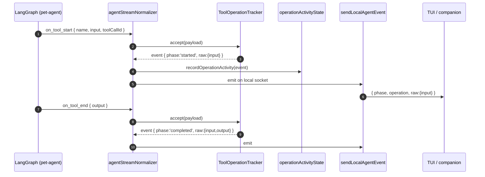

# Local-Agent Event Pipeline

This document describes how tool-call activity inside `pet-agent` becomes
`operation` events that reach a TUI or the macOS companion.

Egress is single and local. The hosted-app relay was removed along with its
`audience`/redaction split: every peer reaches this host over 127.0.0.1 and
receives events unchanged. A Studio plugin that opens a genuinely remote
surface owns its own disclosure policy at that boundary (#638).

## Big picture

```mermaid
flowchart LR
  subgraph pet[pet-agent runtime]
    LG[LangGraph stream<br/>on_tool_start/end]
  end

  subgraph local[local-agent service]
    NORM[agentStreamNormalizer<br/>→ AgentOperationEvent]
    TRK[ToolOperationTracker<br/>(id reuse, finishActive)]
    REG[recordOperationActivity<br/>operationActivityState]
    LOCOUT[sendLocalAgentEvent]
  end

  subgraph trusted[Local clients]
    TUI[TUI]
    MAC[macOS companion]
  end

  LG --> NORM --> TRK --> REG
  REG --> LOCOUT
  LOCOUT -- "raw preserved" --> TUI
  LOCOUT -- "raw preserved" --> MAC
```

One physical egress point exists:

| Egress | File |
| --- | --- |
| Local HTTP/WS server | `localServer.ts`, `localServerChatHandler.ts`, `localServerStudioHandler.ts` |

It calls `sendLocalAgentEvent(ws, event)`, which delivers every event
unchanged — deltas, completed text, operation payloads and snapshots alike.

## Why two modes

`operation.raw.input/output/error` is the unmodified tool-call payload.
Toolkit authors also provide `operations[toolName].summarize{Input,Output,Error}`,
which produce a structured `{ target, summary, details }` projection of the
same data — see `packages/pet-agent/src/types/toolkit.ts`.

These two channels serve different needs:

- `summary/target/details` — small, schema-stable, safe to render anywhere.
  This is the stable display projection toolkit authors guarantee.
- `raw` — the full tool input/output. Useful for UIs that want to do things
  the toolkit author didn't pre-imagine: diff renderers, "expand JSON",
  re-running the call locally, debugging. It can be large and may contain
  sensitive content from the user's environment.

Both transports currently retain `raw`. The hosted app may use it for transient
tool rendering and debugging; it is not treated as a durable sanitized API
projection. If a future public API needs a stricter disclosure contract, that
policy belongs at that API boundary.

## Per-event lifecycle



When a turn ends mid-stream (user interrupt, error), the tracker's
`finishActive(phase, error)` synthesizes terminal events for any tool calls
that didn't naturally complete; they go through the same egress.

## Where `raw` is consumed locally

- `localServerOperationEvents.ts` — pretty-prints `raw.input/error` into the
  local-agent log (truncated). Lives inside the agent process; doesn't cross
  any wire.
- TUI / companion clients receive `event.operation.raw` through the local WS
  parser (`parseLocalAgentServerMessage`) and may use it for diff/inspection
  rendering. UIs that don't need raw can simply ignore it.

## Wire schema reference

```ts
type AgentOperationEvent = {
  type: 'operation';
  requestId: string;
  phase: 'started' | 'updated' | 'completed' | 'failed' | 'interrupted';
  operation: {
    id?: string;
    kind: string;                 // e.g. 'bash.read_file', 'browser.click'
    title?: string;               // human-readable, supplied by toolkit author
    target?: string;              // e.g. file path / URL
    summary?: string;             // short status, e.g. '已完成'
    details?: Record<string, unknown>; // toolkit-defined structured data
    source?: {
      provider: 'toolkit' | 'runtime';
      name: string;
      toolName?: string;
      callId?: string;
    };
  };
  raw?: {
    input?: unknown;
    output?: unknown;
    error?: unknown;
  };
};
```

`AgentOperationEvent` is the canonical operation event type. There is one
event shape, not an internal and an external one.

`buildLocalAgentEventEnvelope` only frames a native event; it applies no
disclosure policy, and neither does the transport.

## Adding a new transport

A new local egress needs no disclosure decision — send the native event.

A transport that leaves this machine is a different matter: `raw` carries
unmodified tool input and output from the user's environment. Such a transport
owns its own disclosure policy at its own boundary rather than reintroducing
one here.
